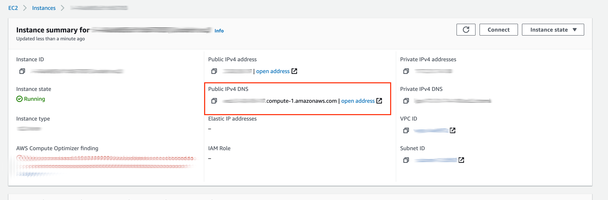
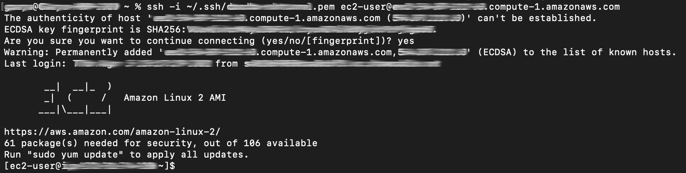
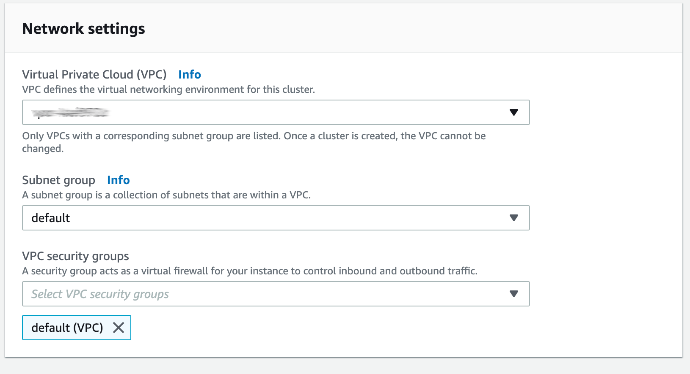
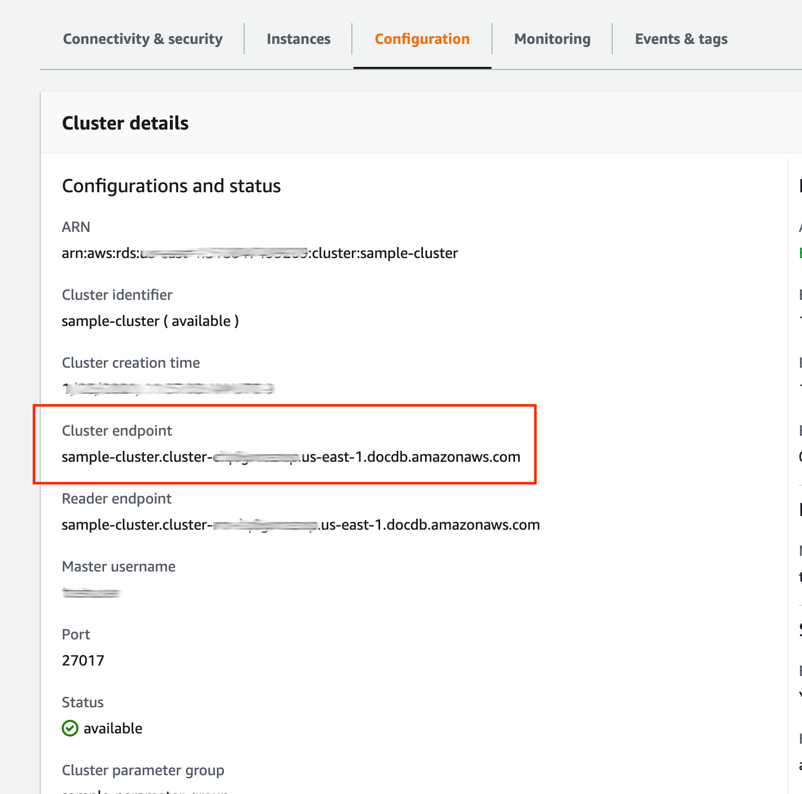

# Getting Started as a Developer
This document provides instructions on how to install and set up Java (JDK 1.8) and an IDE (IntelliJ IDEA) on your computer to be able compile the project source code and run DocumentDB tests.

## Table of Contents
1. [Instructions](#instructions)
    1. [Installing Java](#installing-java)
    2. [Installing IntelliJ](#installing-intellij-idea)
    3. [Cloning Source Code onto Local Computer](#cloning-source-code-onto-local-computer)
    4. [Building Project with Gradle](#building-project-with-gradle)
    5. [Setting Up Environment to Run DocumentDB Tests](#setting-up-environment-to-run-documentdb-tests)
        1. [Connect to a DocumentDB Cluster Using an SSH Tunnel](#connect-to-a-documentdb-cluster-using-an-ssh-tunnel)
            1. [Prerequisites](#prerequisites)
            2. [References](#references)
            3. [Creating an EC2 Instance in a VPC](#creating-an-ec2-instance-in-a-vpc)
            4. [Create a DocumentDB Cluster and an SSH Tunnel](#create-a-documentdb-cluster-and-an-ssh-tunnel)
            5. [Connect with TLS](#connect-with-tls)
            6. [Connect Programmatically](#connect-programmatically)
                1. [Without TLS](#without-tls)
                2. [With TLS](#with-tls)
        2. [Setting Up Environment Variables](#setting-up-environment-variables)
        3. [Bypass Testing DocumentDB](#bypass-testing-documentdb)
2. [Troubleshooting](#troubleshooting)
    1. [Issues with JDK](#issues-with-jdk)
    2. [Error Connecting to DocumentDB Instance (Connection Time Out)](#error-connecting-to-documentdb-instance-connection-time-out)
            
## Instructions
### Installing Java
1. Go to this [page](https://www.oracle.com/java/technologies/javase/javase-jdk8-downloads.html) to download Java SE 
Development Kit 8 (JDK 1.8) for your system and follow installation steps (you need to have or create an Oracle account 
to download).
2. Confirm correct version (1.8) of Java has been installed by running the command `java -version` or `javac -version` 
in the command line or terminal.

### Installing IntelliJ IDEA
1. Go to this [page](https://www.jetbrains.com/idea/download/) to download IntelliJ IDEA Community Edition for your 
system and follow the installation steps (click next and continue with default settings)
2. The plugins *SpotBugs* and *Gradle* need to be installed in the IDE which can be done via the top menu toolbar under 
*IntelliJ IDEA → Preferences → Plugins* (search in the *Marketplace*).

### Cloning Source Code onto Local Computer
1. If you do not have an SSH key associated with your GitHub account, follow the steps on this 
[page](https://docs.github.com/en/github/authenticating-to-github/connecting-to-github-with-ssh/adding-a-new-ssh-key-to-your-github-account) 
to add a new SSH key to your GitHub account.
2. In the Amazon [documentdb-jdbc](https://github.com/aws/amazon-documentdb-jdbc-driver) repository, copy the SSH URL to 
your clipboard when you click the download code button as shown in the image below. 

   

3. Open the command line or terminal and navigate to the folder/directory where you would like to clone the repository 
to and run the following command `git clone X` where `X` is the SSH URL to the repository copied to your clipboard in 
the above step.

### Building Project with Gradle
1. In IntelliJ, open Gradle tool window: navigate to the top menu toolbar *View → Tool Windows → Gradle*.
2. In the Gradle tool window, build the project by double-clicking on gradle task 
*documentdb-jdbc → Tasks → shadow → shadowJar*.
3. After build and compilation, a .jar file should be created in your repository in the subfolder 
*documentdb-jdbc/build/libs*.

   

### Setting Up Environment to Run DocumentDB Tests
This section describes how to connect to a DocumentDB cluster using an SSH tunnel and details the setup needed to run 
tests against the DocumentDB instance.

#### Connect to a DocumentDB Cluster Using an SSH Tunnel
Since DocumentDB is currently a VPC-only service, you need to set up an SSH tunnel using an EC2 instance running in the 
same VPC as your DocumentDB cluster (Note that SSH tunnelling will not work for connecting in replica set mode).

##### Prerequisites
1. Mongo shell (comes with MongoDB server installation but can be downloaded separately)
    1. Download Mongo shell on macOS using HomeBrew by running following commands in the terminal:
        
        ~~~
        brew tap mongodb/brew
        brew install mongodb-community-shell
        ~~~
       
2. AWS account (or a downloaded private key granting access to the cluster)

##### References
1. [Walkthrough on creating an EC2 instance and SSH-ing into it](https://medium.com/serverlessguru/creating-an-aws-ec2-instance-d5cf332fdb0c)
2. [Walkthrough on creating a documentDB cluster with SSH tunnel](https://medium.com/serverlessguru/creating-an-aws-documentdb-cluster-cf658052cef0)

##### Creating an EC2 Instance in a VPC
If you already have an instance of an Amazon EC2 running in the same VPC as your DocumentDB cluster, you can skip these 
steps as long as you have the PEM file for the instance's key pair.
1. Navigate to AWS EC2 Dashboard and select **Launch an Instance**. 
2. Select the **Amazon Linux 2 AMI (HVM), SSD Volume Type** as the machine image and **t2.micro** as the instance type. 
Leave everything as default and launch the instance.  
   1. **NOTE:** This will create the instance in your default VPC. You can select a different VPC if necessary but 
   should remember to create your DocumentDB cluster there as well. 
3. You will be prompted to provide or generate a key pair for the instance. Create a new key pair with a meaningful name 
and download it. Make sure to keep track of this file.
4. Give the instance a meaningful name and wait for the instance to have a state of running. 
5. Move the key pair file (a PEM file) into your ssh directory.

   ~~~
   mv downloads/<key-pair-name>.pem ~/.ssh/
   ~~~
   
6. Modify its permissions.

   ~~~
   chmod 400 ~/.ssh/<key-pair-name>.pem
   ~~~
   
7. SSH into the instance to verify the setup!

   ~~~
   ssh -i ~/.ssh/<key-pair-name>.pem <ec2-username>@<public-IPv4-DNS-name>
   ~~~
   
   Where <ec2-username> is the EC2 username chosen by you when creating a EC2 instance. You can find the public dns name 
   of your instance from the EC2 dashboard. Select your instance and copy the public IPv4 DNS from the instance memory.

   

   Example output:
   
   
   
##### Create a DocumentDB Cluster and an SSH Tunnel
1. Navigate to the DocumentDB dashboard. From the sidebar, select **Parameter Groups** and click **Create**. 
2. Flip the TLS and TTL Monitor switches to disabled. You can leave the TLS switch as enabled if you want to connect 
with TLS right away.
3. From the sidebar, select **Clusters** and click **Create**. 
4. Give the instance a meaningful identifier and choose **t3.medium** as the instance class and **1** as the number of 
instances.

   
   
5. Fill in the authentication section and take note of the master username and password entered. You will use these to 
connect later.
6. Under **Advanced Settings**:
    1. Choose the parameter group created in step 1 as the cluster parameter group.
    
       
       
    2. Choose the VPC used during EC2 instance creation as the VPC.
   
       
       
7. Create the cluster and wait for it to finish spinning up.
8. Once the cluster is available, we can create the SSH tunnel using our EC2 instance. Use the same key pair file and 
public DNS name used to SSH into the EC2 instance. Use the cluster endpoint from the configuration tab of your cluster.

   ~~~
   ssh -i ~/.ssh/<key-pair-name>.pem -N -L 27017:<cluster-endpoint>:27017 <ec2-username>@<public-IPv4-DNS-name>
   ~~~
   
   
9. Open another terminal window and connect to the cluster using the `mongo` shell. Note that we will use localhost 
rather than the cluster endpoint since we have set up the SSH tunnel.

   ~~~
   mongo --host 127.0.0.1:27017 --username <master-username> --password <master-password>
   ~~~

## Database User Account Definitions

The integration tests assume the following two user accounts are created
in the target database server.

### Administrative User

User: `documentdb`

#### Definition:

```json
{
  "user" : "documentdb",
  "roles" : [ {
    "db" : "admin",
    "role" : "root"
  } ]
}
```

### Restricted Access User

User: `docDbRestricted`

#### Definition

```json
{
  "user" : "docDbRestricted",
  "roles" : [ {
    "db" : "admin",
    "role" : "readAnyDatabase"
  } ]
}
```
   
## Connect with TLS
When connecting to a TLS-enabled cluster you can follow the same steps to set up an SSH tunnel but will need to also 
download the Amazon DocumentDB Certificate Authority (CA) file before trying to connect.
1. Download the CA file.

   ~~~
   wget https://s3.amazonaws.com/rds-downloads/rds-combined-ca-bundle.pem
   ~~~
   
2. Set up the SSH tunnel. See step 3 in section [Setting Up Environment Variables](#setting-up-environment-variables) 
for command to start SSH port-forwarding tunnel. 

3. Open another terminal window and connect using the `mongo` shell. Note that since we are using an SSH tunnel to 
access the cluster from localhost, the server certificate does not match the hostname. It is expecting a hostname like 
`sample-cluster.xxxxxxxxxxxx.us-east-1.docdb.amazonaws.com:27017` not `127.0.0.1:27017`. We have to pass the 
`--tlsAllowInvalidHostnames` flag or the handshake will fail.

   ~~~
   mongo --host 127.0.0.1:27017 --username <master-username> --password <master-password> --tls --tlsCAFile rds-combined-ca-bundle.pem --tlsAllowInvalidHostnames 
   ~~~
   
### Connect Programmatically 
#### Without TLS
Connecting without TLS is very straightforward. We essentially follow the same steps as when connecting using the 
`mongo` shell. 
1. Setup the SSH tunnel. See step 3 in section [Setting Up Environment Variables](#setting-up-environment-variables) for 
command to start SSH port-forwarding tunnel.
2. Create a test or simple main to run.
3. Use either the Driver Manager, Data Source class or Connection class to establish a connection to `localhost:27017`. 
Make sure to set the hostname, username, password and target database. The target database can be anything as long as it is a valid MongoDB database name (no spaces, no special chars). See example directly using the connection class: 

   ~~~js
   @Test
   public void sshTunnelTestWithoutSSL() throws SQLException {
       final DocumentDbConnectionProperties properties = new DocumentDbConnectionProperties();
       properties.setHostname("localhost:27017");
       properties.setUser("<user name>");
       properties.setPassword("<password>");
       properties.setDatabase("<target database name>");
       final DocumentDbConnection connection = new DocumentDbConnection(properties);
       connection.close();
   }
   ~~~
   
#### With TLS
Connecting with TLS programmatically is slightly different from how we did it with the `mongo` shell.
1. Create a test or simple main to run.  
2. Use either the Driver Manager, Data Source class or Connection class to establish a connection to `localhost:27017`. 
Make sure to set hostname, username, password, target database and tls parameters. The target database can be anything 
as long as it is a valid MongoDB database name (no spaces, no special chars). See example directly using the connection 
class:
   
   ~~~js
   @Test
   public void sshTunnelTestWithSSL() throws SQLException {
       final DocumentDbConnectionProperties properties = new DocumentDbConnectionProperties();
       properties.setHostname("localhost:27017");
       properties.setTlsEnabled("true");
       properties.setTlsAllowInvalidHostnames("true");
       properties.setUser("<user name>");
       properties.setPassword("<password>");
       properties.setDatabase("<target database name>");
       final DocumentDbConnection connection = new DocumentDbConnection(properties);
       connection.close();
   }
   ~~~

## Integration Testing

By default, integration testing is disabled for local development. To enable
integration testing, follow the directions below.

### Setting Up Environment Variables

To enable integration testing the following environment variables allow
you to customize the credentials and DocumentDB cluster settings.

For MacOS, you may need to make changes to ~/.zshrc, source the file, and restart the IDE for changes to be picked up.

1. Create and set the following environment variables:

| Variable               | Description                                                                                                              | Example                                                                     |
|------------------------|--------------------------------------------------------------------------------------------------------------------------|-----------------------------------------------------------------------------|
| `DOC_DB_USER_NAME`     | This is the DocumentDB user.                                                                                             | `documentdb`                                                                |
| `DOC_DB_PASSWORD`      | This is the DocumentDB password.                                                                                         | `aSecret`                                                                   |
| `DOC_DB_LOCAL_PORT`    | This is the port number used locally via an SSH Tunnel. It is recommend to use a different value than the default 27017. | `27019`                                                                     |
| `DOC_DB_USER`          | This is the user and host of SSH Tunnel EC2 instance.                                                                    | `ec2-user@254.254.254.254`                                                  |
| `DOC_DB_HOST`          | This is the host of the DocumentDB cluster server, including the port, separated by a colon (i.e., \<cluster endpoint>:\<port>).                                                                      | `docdb-jdbc-literal-test.cluster-abcdefghijk.us-east-2.docdb.amazonaws.com:27017` |
| `DOC_DB_PRIV_KEY_FILE` | This is the path to the SSH Tunnel private key-pair file.                                                                | `~/.ssh/ec2-literal.pem`                                                    |

### SSH Tunnel

1. Ensure the private key file <key pair name>.pem is in the location set by the environment variable 
`DOC_DB_PRIV_KEY_FILE`.
2. Assuming you have the environment variables setup above, starting an SSH tunnel from the command line should look like this:

   ~~~shell
   ssh [-f] -N -i $DOC_DB_PRIV_KEY_FILE -L $DOC_DB_LOCAL_PORT:$DOC_DB_HOST:27017 $DOC_DB_USER
   ~~~
 
   - The `-L` flag defines the port forwarded to the remote host and remote port. Adding the `-N` flag means do not 
   execute a remote command, you will not get a shell in this case. The `-f` switch instructs SSH to run in the 
   background.
   
### Enable Integration Testing of Amazon DocumentDB

To enable integration testing in the IDE, update the grade property, as intructed below.

1. Modify the */gradle.properties* file in the source code and uncomment the following line: 
`runRemoteIntegrationTests=true`

### Project Secrets

For the purposes of automated integration testing in **GitHub**, this project maintains the value for the environment variables above
as project secrets. See the workflow file [gradle.yml](https://github.com/aws/amazon-documentdb-jdbc-driver/blob/1edd9e21fdcccfe62d366580702f2904136298e5/.github/workflows/gradle.yml)

## Troubleshooting

### Issues with JDK

1. Confirm project SDK is Java Version 1.8 via the IntelliJ top menu toolbar under 
*File → Project Structure → Platform Settings -> SDK* and reload the JDK home path by browsing to the path and click 
*apply* and *ok*. Restart IntelliJ IDEA.

   

2. If above step does not solve the issue, try to see if reinstalling JDK 1.8 fixes the problem.
    1. For Mac OS/Linux, uninstall JDK using commands below, restart your computer and install JDK 1.8 as describe in 
    the [Instructions](#instructions) section above.
     
       ~~~
       sudo rm -rf /Library/Internet\ Plug-Ins/JavaAppletPlugin.plugin
       sudo rm -rf /Library/Java/JavaVirtualMachines
       sudo rm -rf /Library/Application\ Support/Oracle/Java
       sudo rm -rf /Library/PreferencePanes/JavaControlPanel.prefPane
       ~~~

### Error Connecting to DocumentDB Instance (Connection Time Out)
1. DocumentDB instance and EC2 should be deployed in the same region and use the same VPC. Check Region and VPC.
2. Check Security Policy for EC2 instance allows inbound connections and ensure it is configured as shown in the picture 
below. Go to EC2 Dashboard → **Network & Security** Group in the left menu → **Security** Group.

   

## Release Procedure

1. Create a task and PR to update the version.
   1. Optional: Update dependencies to latest. The version is updated in file `gradle.properties`.
   2. Smoke test to ensure the version is updated.
         1. Generated file includes new version
         2. Using a BI tool like DbVisualizer, connect and check the driver version matches.
   3. Ensure the PR is merged.
2. Run a manual GitHub workflow action for `Amazon DocumentDB JDBC Driver`.
   1. Run workflow →
      1. **Use workflow from**, Branch: `develop`
      2. **Test without DocumentDB?** → `1`
      3. **Prepare files to publish in maven repo?** → `1`
   2. Following the link for the workflow,
      1. Download the `output` artifact.
3. Create a new release
   1. On GitHub releases page for the project, click the **Draft a new release** button.
   2. Version number is `v<M.m.p>` (e.g., `v1.4.3`)
   3. The Release title should be `Amazon DocumentDB JDBC Driver v<M.m.p>` (e.g. `Amazon DocumentDB JDBC Driver v1.4.3`)
   4. For the **Previous tag**, choose the tag for the previous version from the drop-down list.
   5. Click the **Generate release notes** button.
   6. Add artifacts
      1. `documentdb-jdbc-<version>-all.jar` - This can be obtained from the output artifact using the manual workflow action above found inside subfolder jarfile.
      2. `documentdbjdbc-<version>.taco`
         1. **Note**: _Currently (2022-12-20), we are not signing the generated TACO file. So it is a copy of the previous version with the file name changed to the current version._
   7. Enable the **Set as the latest release** option.
   8. Click the **Publish release** button.
4. Upload artifacts bundle to Maven
   1. Go to site: [Nexus Repository Manager](https://aws.oss.sonatype.org/#welcome)
   2. Log in use credentials
      1. account: `aws-docdb-jdbc`
      2. password: `<secret>`
   3. Click **Staging Upload**
   4. Set **Upload Mode** to `Artifact Bundle`
   5. Click the **Select Bundle to Upload**
   6. Select from the `output.zip` artifact downloaded from the manual workflow action, above from the path: `ouput/maven/bundle.jar`
   7. Click the **Upload Bundle**. Wait for upload to complete.
   8. Click the **Staging Repositories** link.
      1. Wait for the bundle to have A**ctivity** of **Last operation completed successfully**
      2. Check the **Content**.
      3. Ensure the bundle is selected. Then click the **Release** button.
 