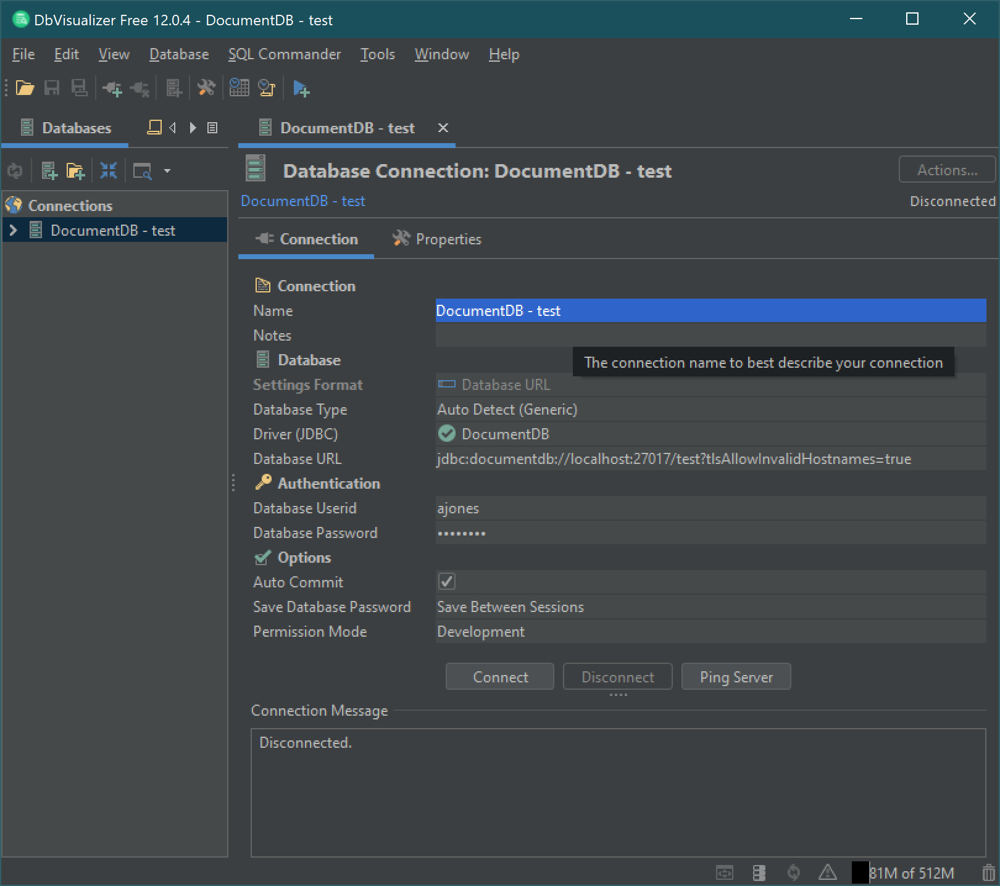
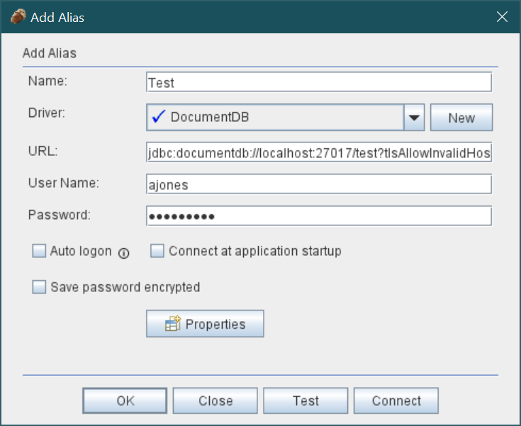

# Amazon DocumentDB JDBC Driver Documentation

## Overview

The JDBC driver for the Amazon DocumentDB managed document database provides an
SQL-relational interface for developers and BI tool users.

## License

This project is licensed under the Apache-2.0 License.

## Documentation

- Setup
    - [Amazon DocumentDB JDBC Driver Setup](#amazon-documentdb-jdbc-driver-setup)
    - [Using an SSH Tunnel to Connect to Amazon DocumentDB](#using-an-ssh-tunnel-to-connect-to-amazon-documentdb)
    - [BI Tool Setup](#bi-tool-setup)
    - [Connection String Syntax and Options](#connection-string-syntax-and-options)
- Managing Schema
    - [Schema Discovery and Generation](#schema-discovery)
    - [Managing Schema Using the Command Line Interface](#managing-schema-using-the-command-line-interface)
    - [Table Schemas JSON Format](#table-schemas-json-format)
- SQL and JDBC Compatibility
    - [SQL and JDBC Support and Limitations](#sql-and-jdbc-support-and-limitations)

---

# Amazon DocumentDB JDBC Driver Setup

## Topics

- [Getting Started](#getting-started)
    - [Prerequisites](#prerequisites)
        - [DocumentDB Cluster](#documentdb-cluster)
        - [JRE or JDK Installation](#jre-or-jdk-installation)
        - [Download the DocumentDB JDBC Driver](#download-the-documentdb-jdbc-driver)
    - [Specifying the Amazon RDS Certificate Authority Certificate File](#specifying-the-amazon-rds-certificate-authority-certificate-file-in-connection-string)
    - [Using an SSH Tunnel to Connect to Amazon DocumentDB](#using-an-ssh-tunnel-to-connect-to-amazon-documentdb)
    - [Next Steps](#next-steps)

## Getting Started

### Prerequisites

#### DocumentDB Cluster

If you don't already have an Amazon DocumentDB cluster, there are a number of ways to
[get started](https://docs.aws.amazon.com/documentdb/latest/developerguide/get-started-guide.html).

Note that DocumentDB is a Virtual Private Cloud (VPC) only service.
If you will be connecting from a local machine outside the cluster's VPC, you will need to
create an SSH connection to an Amazon EC2 instance. In this case, launch your cluster using the instructions in
[Connect with EC2](https://docs.aws.amazon.com/documentdb/latest/developerguide/connect-ec2.html).
See [Using an SSH Tunnel to Connect to Amazon DocumentDB](#using-an-ssh-tunnel-to-connect-to-amazon-documentdb)
for more information on ssh tunneling and when you might need it.

#### JRE or JDK Installation

Depending on your BI application, you may need to ensure a 64-bit JRE or JDK installation version 8
or later is installed on your computer. You can download the Java SE Runtime Environment 8
[here](https://www.oracle.com/ca-en/java/technologies/javase-jre8-downloads.html).

#### Download the DocumentDB JDBC Driver

<!-- >TODO: Get link for DocumentDB JDBC driver. -->
Download the DocumentDB JDBC driver [here](https://github.com/aws/amazon-documentdb-jdbc-driver/releases). The driver is packaged as a single JAR file
(e.g., `documentdb-jdbc-1.0-SNAPSHOT-all.jar`).

### Specifying the Amazon RDS Certificate Authority Certificate File in Connection String

If you are connecting to a TLS-enabled cluster, you may want to
[specify the Amazon RDS Certificate Authority certificate](#specifying-the-amazon-rds-certificate-authority-certificate-file) on your connection string.

To determine whether your cluster is TLS-enabled, you can
[check the value of your cluster's `tls` parameter](https://docs.aws.amazon.com/documentdb/latest/developerguide/connect_programmatically.html#connect_programmatically-determine_tls_value).

### Using an SSH Tunnel to Connect to Amazon DocumentDB

Amazon DocumentDB (with MongoDB compatibility) clusters are deployed within an Amazon Virtual Private Cloud (Amazon VPC).
They can be accessed directly by Amazon EC2 instances or other AWS services that are deployed in the same Amazon VPC.
Additionally, Amazon DocumentDB can be accessed by EC2 instances
or other AWS services in different VPCs in the same AWS Region or other Regions via VPC peering.

However, suppose that your use case requires that you (or your application) access your Amazon DocumentDB resources
from outside the cluster's VPC. This will be the case for most users not running their application
on a VM in the same VPC as the DocumentDB cluster. When connecting from outside the VPC,
you can use SSH tunneling (also known as  _port forwarding_) to access your Amazon DocumentDB resources.

To create an SSH tunnel, you need an Amazon EC2 instance running in the same Amazon VPC as your Amazon DocumentDB cluster. You can either use an existing EC2 instance in the same VPC as your cluster or create one.

You can set up an SSH tunnel to the Amazon DocumentDB cluster `sample-cluster.node.us-east-1.docdb.amazonaws.com` by running the following command on your local computer. The `-L` flag is used for forwarding a local port.

```
ssh -i "ec2Access.pem" -L 27017:sample-cluster.node.us-east-1.docdb.amazonaws.com:27017 ubuntu@ec2-34-229-221-164.compute-1.amazonaws.com -N 
```

This is a prerequisite for connecting to any BI tool running on a client outside your VPC. Once you run the step above you can move on to the next steps for the BI tool of your choice.

For further information on SSH tunneling , please refer to the documentation on
[Connecting from Outside an Amazon VPC.](https://docs.aws.amazon.com/documentdb/latest/developerguide/connect-from-outside-a-vpc.html)

## Next Steps

To learn how to set up and work with various BI tools, see the
[BI Tool Setup documentation](#bi-tool-setup) for more detail.

---

# Connection String Syntax and Options

`jdbc:documentdb://[<user>[:<password>]@]<hostname>[:<port>]/<database-name>[?<option>=<value>[&<option>=<value>[...]]]`

### Scheme

`jdbc:documentdb:` Required: the scheme for this JDBC driver.

### Parameters

- `<user>` Optional: the username of the authorized user. While the username is optional on the
  connection string, it is still required either via the connection string, or the properties.
  _Note: the username must be properly (%) encoded to avoid any confusion with URI special
  characters._
- `<password>` Optional: the password of the authorized user. While the password is optional on the
  connection string, it is still required either via the connection string, or the properties.
  _Note: the password must be properly (%) encoded to avoid any confusion with URI special
  characters._
- `<hostname>` Required: the hostname or IP address of the DocumentDB server or cluster.
- `<port>` Optional: the port number the DocumentDB server or cluster is listening on.
- `<database>` Required: the name of the database the JDBC driver will connect to.
- `<option>` Optional: one of the connection string options listed below.
- `<value>` Optional: the associated value for the option.

### Options

- `appName` (string) : Sets the logical name of the application.
- `loginTimeoutSec` (int) : How long a connection can take to be opened before timing out (in seconds).
  Alias for connectTimeoutMS but using seconds.
- `readPreference` (enum/string) : The read preference for this connection. Allowed values:
    - `primary` (default)
    - `primaryPreferred`
    - `secondary`
    - `secondaryPreferred`
    - `nearest`.
- `replicaSet` (string) : Name of replica set to connect to. For now, passing a name other than
  `rs0` will log a warning.
- `retryReads` (true|false) : If true, the driver will retry supported read operations if they
  fail due to a network error. Defaults to `true`.
- `tls` (true|false) : If true, use TLS encryption when communicating with the DocumentDB server.
  Defaults to `true`.
- `tlsAllowInvalidHostnames` (true|false) : If true, invalid host names for the TLS certificate
  are allowed. This is useful when using an SSH tunnel to a DocumentDB server. Defaults to false.
- `tlsCAFile` (string) : The path to the trusted Certificate Authority (CA) `.pem` file. If the
  path starts with the tilde character (`~`), it will be replaced with the user's home directory.
  Ensure to use only forward slash characters (`/`) in the path or URL encode the path. Providing
  the trusted Certificate Authority (CA) `.pem` file is optional as the current Amazon RDS root CA
  is used by default when the `tls` option is set to `true`. This embedded certificate is set to
  expire on 2024-08-22. For example, to provide a new trusted Certificate Authority (CA) `.pem`
  file that is located in the current user's `Downloads` subdirectory of their home directory,
  use the following: `tlsCAFile=~/Downloads/rds-ca-2019-root.pem`.
- `scanMethod` (enum/string) : The scanning (sampling) method to use when discovering collection
  metadata for determining table schema. Possible values include the following:
    - `random` - (default) The sample documents are returned in _random_ order.
    - `idForward` - The sample documents are returned in order of id.
    - `idReverse` - The sample documents are returned in reverse order of id.
    - `all` - Sample all the documents in the collection.
- `scanLimit` (int) The number of documents to sample. The value must be a positive integer.
  The default value is `1000`. If `scanMethod` is set to `all`, this option is ignored.
- `schemaName` (string) The name of the SQL mapping schema for the database. Defaults to `_default`.

## Examples

### Connecting to an Amazon DocumentDB Cluster

```
jdbc:documentdb://localhost/customer?tlsAllowInvalidHostnames=true
```

#### Notes:

1. An [SSH tunnel](#using-an-ssh-tunnel-to-connect-to-amazon-documentdb) is being used where the local port is `27017` (`27017` is default).
1. The Amazon DocumentDB database name is `customer`.
1. The Amazon DocumentDB is TLS-enabled (`tls=true` is default)
1. User and password values are passed to the JDBC driver using **Properties**.

### Connecting to an Amazon DocumentDB Cluster on Non-Default Port

```
jdbc:documentdb://localhost:27117/customer?tlsAllowInvalidHostnames=true
```

#### Notes:

1. An SSH tunnel is being used where the local port is `27117`.
1. The Amazon DocumentDB database name is `customer`.
1. The Amazon DocumentDB is TLS-enabled (`tls=true` is default).
1. User and password values are passed to the JDBC driver using **Properties**.

### Change the Scanning Method when Connecting to an Amazon DocumentDB Cluster

```
jdbc:documentdb://localhost/customer?tlsAllowInvalidHostnames=true&scanMethod=idForward&scanLimit=5000
```

#### Notes:

1. An SSH tunnel is being used where the local port is `27017` (`27017` is default).
1. The Amazon DocumentDB database name is `customer`.
1. The Amazon DocumentDB is TLS-enabled (`tls=true` is default).
1. User and password values are passed to the JDBC driver using **Properties**.
1. The scan method `idForward` will order the result using the `_id` column in the collection.
1. The scan limit `5000` will limit the number of scanned documents to 5000.

---

# BI Tool Setup

The DocumentDB JDBC driver can be setup for a number of business integration (BI) applications.
Outlined here are the setup for [Tableau Desktop](https://www.tableau.com/products/desktop),
[DbVisualizer](https://www.dbvis.com/) and
[SQirreL SQL Client](https://sourceforge.net/projects/squirrel-sql/).

## Topics

- [BI Tool Setup](#bi-tool-setup)
    - [Tableau Desktop](#tableau-desktop)
    - [DbVisualizer](#dbvisualizer)
    - [SQuirreL SQL Client](#squirrel-sql-client)

## Tableau Desktop

### Adding the Amazon DocumentDB JDBC Driver

1. [Download](#download-the-documentdb-jdbc-driver) the DocumentDB JDBC driver JAR file and copy it to one of these
   directories according to your operating system:

    - **_Windows_**: `C:\Program Files\Tableau\Drivers`
    - **_Mac_**: `~/Library/Tableau/Drivers`
    - **_Linux_**: `/opt/tableau/tableau_driver/jdbc`

1. [Download]() the DocumentDB Tableau connector (a TACO file) and copy it to your `My Tableau Repository/Connectors`
   directory.
    - **_Windows_**: `C:\Users\[user]\Documents\My Tableau Repository\Connectors`
    - **_Mac_**: `/Users/[user]/Documents/My Tableau Repository/Connectors`

   For more information, consult the [Tableau documentation](https://tableau.github.io/connector-plugin-sdk/docs/run-taco).

### Connecting to Amazon DocumentDB Using Tableau

1. If connecting from outside the DocumentDB cluster's VPC, ensure you have [setup an SSH tunnel](#using-an-ssh-tunnel-to-connect-to-amazon-documentdb).
1. Launch the Tableau Desktop application.
    - If using a **signed** Tableau Connector, launch Tableau like a typical application on your machine.
    - If using an **unsigned** Tableau connector, Tableau must be launched from the command line with the flag
      `-DDisableVerifyConnectorPluginSignature=true`.

      Assuming default installation of Tableau Desktop:
        - On **Windows**, use `tableau.exe -DDisableVerifyConnectorPluginSignature=true`.
        - On **Mac**, use `/Applications/Tableau\ Desktop\ [version].app/Contents/MacOS/Tableau -DDisableVerifyConnectorPluginSignature=true`.
        - For more information, consult the [Tableau documentation](https://tableau.github.io/connector-plugin-sdk/docs/run-taco).

1. Navigate to **Connect > To A Server > More**. **Amazon DocumentDB by Amazon DocumentDB** should be listed
   under **Installed Connectors**. Select it.


1. Enter the parameters. **Hostname**, **Port**, **Database**, **Username** and **Password**
   are required while the others are optional. Descriptions for each parameter can be found in
   the [JDBC connection string](#connection-string-syntax-and-options) documentation. As an example, the image below
   is equivalent to the connection string:
   `jdbc:documentdb://localhost:27019/test?tls=true&tlsAllowInvalidHostnames=true&scanMethod=random&scanLimit=1000&loginTimeoutSec=0&readPreference=primary&retryReads=true&schemaName=_default`
   with username and password passed separately in a properties collection.
1. Click the **Sign In** button.


## DbVisualizer

### Adding the Amazon DocumentDB JDBC Driver

Start the DbVisualizer application and navigate to the menu path: **Tools > Driver Manager...**

Click the plus icon (or menu path **Driver > Create Driver**)

1. For the **Name:** field, enter **DocumentDB**
1. For the **URL Format:** field, enter `jdbc:documentdb://<host>[:port]/<database>[?option=value[&option=value[...]]]`
1. Click the **folder** button on the right. Navigate to the location of your downloaded
   Amazon DocumentDB JDBC driver JAR file. Select the file and click the **Open** button.
   
1. Ensure the `software.amazon.documentdb.jdbc.DocumentDbDriver` is selected in the **Driver Class:**
   field. Your Driver Manager settings for **DocumentDB** should look like the following image.
   
1. Close the dialog. The **DocumentDB** JDBC driver will be setup and ready to use.

### Connecting to Amazon DocumentDB Using DbVisualizer

1. If connecting from outside the DocumentDB cluster's VPC, ensure you have [setup an SSH tunnel](#using-an-ssh-tunnel-to-connect-to-amazon-documentdb).
1. Navigate the menu path **Database > Create Database Connection**.
1. For the **Name** field, enter a descriptive name for the connection.
1. For the **Driver (JDBC)** field, choose the **DocumentDB** driver you created earlier.
1. For the **Database URL** field, enter your [JDBC connection string](#connection-string-syntax-and-options).
   For example, `jdbc:documentdb://localhost:27017/database?tlsAllowInvalidHostnames=true`
1. For the **Database Userid** field, enter your Amazon DocumentDB user ID.
1. For the **Database Password** field, enter the corresponding password for the user ID.
1. Your **Database Connection** dialog should look like the following.
   
1. Click the **Connect** button to make the connection to your Amazon DocumentDB database.

## SQuirreL SQL Client

### Adding the Amazon DocumentDB JDBC Driver

1. If connecting from outside the DocumentDB cluster's VPC, ensure you have [setup an SSH tunnel](#using-an-ssh-tunnel-to-connect-to-amazon-documentdb).
1. Launch the SQuirrel SQL Client application.
1. Ensure the **Drivers** tab is selected.
1. Navigate to menu path ***Drivers > New Driver ...***
1. For the **Name:** field, enter **DocumentDB**.
1. For the **Example URL:** field, enter `jdbc:documentdb://<host>[:port]/<database>[?option=value[&option=value[...]]]`
1. Select the **Extra Class Path** tab.
1. Click the **Add** button and navigate to the downloaded Amazon DocumentDB JDBC driver JAR file.
1. Click **OK** to add the JAR file to the **Extra Class Path**.
1. Click the **List Drivers** button.
1. For the **Class Name:** field, ensure the `software.amazon.documentdb.jdbc.DocumentDbDriver`
   is selected.
   
1. Click the **OK** button to create and save the driver settings.

### Connecting to Amazon DocumentDB Using SQuirreL SQL Client

1. If connecting from outside the DocumentDB cluster's VPC, ensure you have [setup an SSH tunnel](#using-an-ssh-tunnel-to-connect-to-amazon-documentdb).
1. Launch the SQuirrel SQL Client application.
1. Ensure the **Aliases** table is selected.
1. Navigate the menu path **Aliases > New Alias...**.
1. For the **Name:** field, enter a name for this alias.
1. For the **Driver:** field, ensure **DocumentDB** is selected.
1. For the **URLS:** field, enter your [JDBC connection string](#connection-string-syntax-and-options).
   For example, `jdbc:documentdb://localhost:27017/database?tlsAllowInvalidHostnames=true`
1. For the **User Name:** field, enter your Amazon DocumentDB user ID.
1. For the **Password** field, enter the corresponding password for the user ID.  
   
1. Click **OK** to save the alias.
1. Double-click your alias to start the connection dialog.
1. Click the **Connect** button to connect.

---

# Specifying the Amazon RDS Certificate Authority Certificate File

By default, an Amazon RDS Certificate Authority root certificate is embedded in the JDBC driver JAR
file which should work when connecting to Amazon DocumentDB clusters using SSL/TLS encryption.
However, if you want to provide a new Amazon RDS Certificate Authority root certificate, follow the
direction below.

The certificates are distributed
[bundled or unbundled](https://docs.aws.amazon.com/AmazonRDS/latest/UserGuide/UsingWithRDS.SSL.html).

1. [Download the root CA certificate](https://s3.amazonaws.com/rds-downloads/rds-ca-2019-root.pem)
1. We recommend you relocate the file into your user's home directory:
    1. Window: `$HOME`
    1. MacOS/Linus: `~`
1. Add the `tlsCAFile` option to your [JDBC connection string](#connection-string-syntax-and-options).
   For example, `jdbc:documentdb://localhost:27117/customer?tlsAllowInvalidHostnames=true&tlsCAFile=~/rds-ca-2019-root.pem`

---

# Schema Discovery

## Automated Discovery Behavior

When the JDBC driver connection needs to get the schema for the collection in the database,
it will poll for all the collections in the database.

The driver will determine if a cached version of the schema for that collection already exists.
If a cached version does not exist, it will sample the collection for documents and create a schema
based on the following behavior.

### Scanning Method Options

The sampling behavior can be modified using connection string or datasource options.

- `scanMethod=<option>`
    - `random` - (default) The sample documents are returned in _random_ order.
    - `idForward` - The sample documents are returned in order of id.
    - `idReverse` - The sample documents are returned in reverse order of id.
    - `all` - Sample all the documents in the collection.
- `scanLimit=<n>` - The number of documents to sample. The value must be a positive integer.
  The default value is `1000`. If `scanMethod` is set to `all`, this option is ignored.

### DocumentDB Data Types

The DocumentDB server supports a number of MongoDB data types. Listed below are the supported data
types, and their associated JDBC data types.

| MongoDB Data Type | Supported in DocumentDB | JDBC Data Type |
| ----------- | ----------- | ----------- |
| Binary Data| Yes | VARBINARY |
| Boolean | Yes | BOOLEAN |
| Double | Yes | DOUBLE |
| 32-bit Integer | Yes | INTEGER |
| 64-bit Integer | Yes | BIGINT |
| String | Yes | VARCHAR |
| ObjectId | Yes | VARCHAR |
| Date | Yes | TIMESTAMP |
| Null | Yes | VARCHAR |
| Regular Expression | Yes | VARCHAR |
| Timestamp | Yes | VARCHAR |
| MinKey | Yes | VARCHAR |
| MaxKey | Yes | VARCHAR |
| Object | Yes | _virtual table_ |
| Array | Yes | _virtual table_ |
| Decimal128 | No | DECIMAL |
| JavaScript | No | VARCHAR |
| JavaScript (with scope) | No | VARCHAR |
| Undefined | No | VARCHAR |
| Symbol | No | VARCHAR |
| DBPointer (4.0+) | No | VARCHAR |

### Mapping Scalar Document Fields

When scanning a sample of documents from a collection, the JDBC driver will create one or more
schema to represent the samples in the collection. In general, a scalar field in the document
maps to a column in the table schema. For example, in a collection named `team`, and a single
document `{ "_id" : "112233", "name" : "Alastair", "age" : 25 }`, this would map to schema:

| Table Name | Column Name | Data Type | Key |
| ---| --- | --- | --- |
| team | _**team__id**_ | VARCHAR | PK |
| team | name | VARCHAR | |
| team | age | INTEGER | |

### Data Type Conflict Promotion

When scanning the sampled documents, it is possible that the data types for a field are not
consistent from document to document. In this case, the JDBC driver will _promote_ the JDBC data
type to a common data type that will suit all data types from the sampled documents.

#### Example

```json
{
  "_id" : "112233",
  "name" : "Alastair",
  "age" : 25
}
```

```json
{
  "_id" : "112244",
  "name" : "Benjamin",
  "age" : "32"
}
```

The `age` field is of type _32-bit integer_ in the first document but _string_ in the second document.
Here the JDBC driver will promote the JDBC data type to VARCHAR to handle either data type when
encountered.

| Table Name | Column Name | Data Type | Key |
| ---| --- | --- | --- |
| team | _**team__id**_ | VARCHAR | PK |
| team | name | VARCHAR | |
| team | age | VARCHAR | |

### Scalar-Scalar Conflict Promotion

The following diagram shows the way in which scalar-scalar data type conflicts are resolved.


### Object and Array Data Type Handling

So far, we've only described how scalar data types are mapped. Object and Array data types are
(currently) mapped to virtual tables. The JDBC driver will create a virtual table to represent
either object or array fields in a document. The name of the mapped virtual table will concatenate the
original collection's name followed by the field's name separated by an underscore character ("_").

The base table's primary key ("_id") takes on a new name in the new
virtual table and is provided as a foreign key to the associated base table.

For embedded array type fields, index columns are generated to represent the
index into the array at each level of the array.

#### Embedded Object Field Example

For object fields in a document, a mapping to a virtual table is created by the
JDBC driver.

Collection: `customer`

```json
{
  "_id" : "112233",
  "name" : "George Jackson",
  "address" : {
    "address1" : "123 Avenue Way",
    "address2" : "Apt. 5",
    "city" : "Hollywood",
    "region" : "California",
    "country" : "USA",
    "code" : "90210"
  }
}
```

maps to schema for `customer` table, ...

| Table Name | Column Name | Data Type | Key |
| --- | --- | --- | --- |
| customer | _**customer__id**_ | VARCHAR | PK |
| customer | name | VARCHAR | |

... and the `customer_address` virtual table

| Table Name | Column Name | Data Type | Key |
| --- | --- | --- | --- |
| customer_address | _**customer__id**_ | VARCHAR | PK/FK |
| customer_address | address1 | VARCHAR | |
| customer_address | address2 | VARCHAR | |
| customer_address | city | VARCHAR | |
| customer_address | region | VARCHAR | |
| customer_address | country | VARCHAR | |
| customer_address | code | VARCHAR | |

So the resulting data in the two tables would look like this...

#### Table: customer

| _**customer__id**_ | name |
| --- | --- |
| "112233" | "George Jackson" |

#### Virtual Table: customer_address

| _**customer__id**_ | address1 | address2 | city | region | country | code |
| --- | --- | --- | --- | --- | --- | --- |
| "112233" | "123 Avenue Way" | "Apt. 5" | "Hollywood" | "California" | "USA" | "90210" |

To query the data and return all columns, use the following query with a
JOIN statement to get the matching address data.

```mysql-sql
SELECT * FROM "customer"
  INNER JOIN "customer_address"
    ON "customer"."customer__id" = "customer_address"."customer__id"
```

#### Embedded Array Field Example

For array fields in a document, a mapping to a virtual table is also created by the
JDBC driver.

Collection: `customer1`

```json
{
  "_id" : "112233",
  "name" : "George Jackson",
  "subscriptions" : [
    "Vogue",
    "People",
    "USA Today"
  ]
}
```

maps to schema for the `customer1` table, ...

| Table Name | Column Name | Data Type | Key |
| --- | --- | --- | --- |
| customer1 | _**customer1__id**_ | VARCHAR | PK |
| customer1 | name | VARCHAR | |

... and the `customer1_subscriptions` virtual table

| Table Name | Column Name | Data Type | Key |
| --- | --- | --- | --- |
| customer1_subscriptions | _**customer1__id**_ | VARCHAR | PK/FK |
| customer1_subscriptions | subscriptions_index_lvl0 | BIGINT | PK |
| customer1_subscriptions | value | VARCHAR | |

So the resulting data in the two tables would look like this...

#### Table: customer1

| _**customer1__id**_ | name |
| --- | --- |
| "112233" | "George Jackson" |

#### Virtual Table: customer1_subscriptions

| _**customer1__id**_ | subscriptions_index_lvl0 | value |
| --- | --- | --- |
| "112233" | 0 | "Vogue" |
| "112233" | 1 | "People" |
| "112233" | 2 | "USA Today" |

To query the data and return all columns, use the following query with a
JOIN statement to get the matching _subscriptions_ data.

```mysql-sql
SELECT * FROM "customer1"
  INNER JOIN "customer1_subscriptions"
    ON "customer"."customer1__id" = "customer_address"."customer1__id"
```

### Scalar-Complex Type Conflict Promotion

Like the scalar-scalar type conflicts, the same field in different documents can have conflicting
data types between complex (array and object) and scalar (integer, boolean, etc.). All of these
conflicts are resolved (promoted) to VARCHAR for those fields. In this case, array and object data
is returned as the JSON representation.

#### Embedded Array - String Field Conflict Example

Collection: `customer2`

```json
{
  "_id" : "112233",
  "name" : "George Jackson",
  "subscriptions" : [
    "Vogue",
    "People",
    "USA Today"
  ]
}
```

```json
{
  "_id" : "112244",
  "name" : "Joan Starr",
  "subscriptions" : 1
}
```

maps to schema for the `customer2` table, ...

| Table Name | Column Name | Data Type | Key |
| --- | --- | --- | --- |
| customer2 | _**customer2__id**_ | VARCHAR | PK |
| customer2 | name | VARCHAR | |
| customer2 | subscription | VARCHAR | |

So the resulting data in the table would look like this...

#### Table: customer2

| _**customer2__id**_ | name | subscriptions |
| --- | --- | --- |
| "112233" | "George Jackson" | "\[ \\"Vogue\\", \\"People\\",  \\"USA Today\\" \]" |
| "112244" | "Joan Starr" | "1" |

---

# Managing Schema Using the Command Line Interface

## Syntax

```
java -jar documentdb-jdbc-<version>.jar [-g | -r | -l | -b | -e <[table-name[,...]]> | -i <file-name>]
        -s <host-name> -d <database-name> -u <user-name> [-p <password>] [-t] [-a]
        [-n <schema-name>] [-m <method>] [-x <max-documents>] [-o <file-name>]
        [-h] [--version]
```

### Command Options

The command options specify which function the interface should perform. Exactly one of the command
options must be provided.

|Option|Description|
|---:|---|
| `-g`, <br><span style="white-space: nowrap;">`--generate-new`</span> | Generates a new schema for the database. This will have the effect of replacing an existing schema of the same name, if it exists. |
| `-e`, <br><span style="white-space: nowrap;">`--export <[table-name[,...]]>`</span> | Exports the schema to for SQL tables named `[<table-name>[,<table-name>[…]]]`. If no `<table-name>` are given, all table schema will be exported. By default, the schema is written to `stdout`. Use the `-o` option to write to a file. The output format is JSON. |
| `-i`, <br><span style="white-space: nowrap;">`--import <file-name>`</span> | Imports the schema from `<file-name>` in your home directory. The schema will be imported using the `<schema-name>` and a new version will be added - replacing the existing schema. The expected input format is JSON. |
| `-l`, <br><span style="white-space: nowrap;">`--list-schema`</span> | Lists the schema names, version and table names available in the schema repository. |
| `-b`, <br><span style="white-space: nowrap;">`--list-tables`</span> | Lists the SQL table names in a schema. |
| `-r`, <br><span style="white-space: nowrap;">`--remove`</span> | Removes the schema from storage for schema given by `-n <schema-name>`, or for schema `_default`, if not provided. |

### Connection Options

The connection options provide the settings needed to connect to your Amazon DocumentDB cluster.

|Option|Description|Default|
|---:|---|---|
| `-s`, <br><span style="white-space: nowrap;">`--server <host-name>`</span> | The hostname and optional port number (default: `27017`) in the format `hostname[:port]`. (required) | |
| `-d`, <br><span style="white-space: nowrap;">`--database <database-name>`</span> | The name of the database for the schema operations. (required) | |
| `-u`, <br><span style="white-space: nowrap;">`--user <user-name>`</span> | The name of the user performing the schema operations. **Note**: *the user will require **readWrite** role on the `<database-name>` where the schema are stored if creating or modifying schema.* (required) | |
| `-p`, <br><span style="white-space: nowrap;">`--password <password>`</span> | The password for the user performing the schema operations. If this option is not provided, the end-user will be prompted to enter the password directly on the command line. (optional) | |
| `-t`, <br><span style="white-space: nowrap;">`--tls`</span> | The indicator of whether to use TLS encryption when connecting to DocumentDB. (optional) | `false` |
| `-a`, <br><span style="white-space: nowrap;">`--tls-allow-invalid-hostnames` </span> | The indicator of whether to allow invalid hostnames when connecting to DocumentDB. (optional) | `false` |

### Schema Options

The schema options provide the setting to override default behavior for schema management.

|Option|Description|Default|
|---:|---|---|
| `-n`, <br><span style="white-space: nowrap;">`--schema-name <schema-name>`</span> | The name of the schema. (optional) | `_default` |
| `-m`, <br><span style="white-space: nowrap;">`--scan-method <method>`</span> | The scan method to sample documents from the collections. One of: `random`, `idForward`, `idReverse`, or `all`. Used in conjunction with the `--generate-new` command. (optional) | `random` |
| `-x`, <br><span style="white-space: nowrap;">`--scan-limit <max-documents>`</span> | The maximum number of documents to sample in each collection. Used in conjunction with the --generate-new command. (optional) | `1000` |
| `-o`, <br><span style="white-space: nowrap;">`--output <file-name>`</span> | Write the exported schema to `<file-name>` in your home directory (instead of stdout). This will overwrite any existing file with the same name | `stdout` |

### Miscellaneous Options

The miscellaneous options provide more information about this interface.

|Option|Description|
|---:|---|
| `-h`, <br><span style="white-space: nowrap;">`--help`</span> | Prints the command line syntax. (optional) |
| <span style="white-space: nowrap;">`--version`</span> | Prints the version number of the command. (optional) |

## Examples

### Generate Schema using Default Schema Name

```
> java -jar document-db-1.0.SNAPSHOT-all.jar --generate-new \
        --server localhost:27019 --database test -u ajones --tls --tls-allow-invalid-hostnames
Password:

New schema '_default', version '1' generated.
```

### Generate Schema using Custom Schema Name

```
> java -jar document-db-1.0.SNAPSHOT-all.jar --generate-new --schema-name=products \
        --server localhost:27019 --database test -u ajones --tls --tls-allow-invalid-hostnames
Password:

New schema 'products', version '1' generated.
```

### Removing Custom Schema
```
> java -jar document-db-1.0.SNAPSHOT-all.jar --remove --schema-name=products \
        --server localhost:27019 --database test -u ajones --tls --tls-allow-invalid-hostnames
Password:

Removed schema 'products'.
```

### Password as Option

```
> java -jar document-db-1.0.SNAPSHOT-all.jar --generate-new \
        --server localhost:27019 --database test -u ajones -p secret --tls --tls-allow-invalid-hostnames

New schema '_default', version '2' generated.
```

### Listing Schema

```
> java -jar document-db-1.0.SNAPSHOT-all.jar --list-schema \
        --server localhost:27019 --database test -u ajones -p secret --tls --tls-allow-invalid-hostnames

Name=_default, Version=1, SQL Name=test, Modified=2021-06-01T10:35:08-07:00
```

### Listing Table Schema

```
> java -jar document-db-1.0.SNAPSHOT-all.jar --list-tables \
        --server localhost:27019 --database test -u ajones -p secret --tls --tls-allow-invalid-hostnames

products
products_additional_tarriffs
products_for
products_limits
products_limits_data
products_limits_sms
products_limits_voice
products_type
projects
```

### Exporting Schema to Stdout

```
> java -jar document-db-1.0.SNAPSHOT-all.jar --export=products,products_for \
        --server localhost:27019 --database test -u ajones -p secret --tls --tls-allow-invalid-hostnames

[ {
  sqlName : products,
  collectionName : products,
  columns : [ {
    fieldPath : _id,
    sqlName : products__id,
    sqlType : varchar,
    dbType : object_id,
    isPrimaryKey : true
  }, {
    fieldPath : fieldDouble,
    sqlName : fieldDouble,
    sqlType : double,
    dbType : double
  }, {
  
  ...
  
} ]
```

### Exporting Schema to File

```
> java -jar document-db-1.0.SNAPSHOT-all.jar --export=products,products_for -o "sql-schema.json" \
        --server localhost:27019 --database test -u ajones -p secret --tls --tls-allow-invalid-hostnames
> cd ~
> cat sql-schema.json
[ {
  sqlName : products,
  collectionName : products,
  columns : [ {
    fieldPath : _id,
    sqlName : products__id,
    sqlType : varchar,
    dbType : object_id,
    isPrimaryKey : true
  }, {
    fieldPath : fieldDouble,
    sqlName : fieldDouble,
    sqlType : double,
    dbType : double
  }, {
  
  ...
  
} ]
```

### Importing Schema

```
> java -jar document-db-1.0.SNAPSHOT-all.jar --import=sql-schema.json \
        --server localhost:27019 --database test -u ajones -p secret --tls --tls-allow-invalid-hostnames
```

---

# Table Schemas JSON Format

## Format Description

The exported JSON format has the following characteristics:

1. A non-empty array (list) of table schema.
1. Each table schema is an object with the following fields:
    1. `sqlName` - (_required_) The SQL name of the table used in SQL queries.
       Values are _case-sensitive_.
    1. `collectionName` - (_required_) The name of the DocumentDB collection associated with this table.
       Values are _case-sensitive_.
    1. `columns` - (_required_) The ordered non-empty array (list) of columns in the SQL table.
1. Each element of the `columns` array is and object with the following fields:
    1. `fieldPath` - (_required_) The relative path of the field in the collection document.
       Values are _case-sensitive_.
    1. `sqlName` - (_required_) The SQL name of the column used in SQL queries.
       Values are _case-sensitive_.
    1. `sqlType` - (_required_) The SQL data type for this column in the table.
       Allowed values: `"bigint"`, `"boolean"`, `"decimal"`, `"double"`, `"integer"`, `"null"`, `"timestamp"`,
       `"varbinary"`, `"varchar"`.
    1. `dbType` - (_required_) The DocumentDB data type from the collection.
       Allowed values: `"binary"`,`"boolean"`,`"date_time"`,`"decimal128"`,`"double"`,`"int32"`,`"int64"`,
       `"max_key"`,`"min_key"`,`"null"`,`"object_id"`,`"string"`.
       At this time, the query engine ignores this value. It is recommended to not change this value
       from the generated value.
    1. `isPrimaryKey` - (_optional_) A boolean indicator of whether the column is part of the
       primary key for this table. Allowed values: `true` or `false`.
    1. `foreignKeyTableName` - (_optional_) The SQL table name of the foreign key.
       Values are _case-sensitive_.
    1. `foreignKeyColumnName` - (_optional_) The SQL column name of the foreign key.
       Values are _case-sensitive_.

### Uniqueness Requirement

1. Within the list of table objects, the `sqlName` field _should_ be unique. Otherwise, the last
   table object with that non-unique `sqlName` will replace earlier tables with the same `sqlName` value.
1. Within the list of column object, the `sqlName` field _must_ be unique. Otherwise, the schema will
   fail to load indicating a "duplicate key" exception.

## JSON Schema Validation

You may want to validate your changes to the file using this [JSON schema](#json-schema).
Check your changes using an [online site](https://www.jsonschemavalidator.net/) to determine if your
changes will be accepted when importing the file.

### JSON Schema

```json
{
  "$schema": "http://json-schema.org/draft-07/schema",
  "$id": "https://github.com/aws/amazon-documentdb-jdbc-driver/tree/develop/src/markdown/schema/table-schemas.schema.json",
  "type": "array",
  "title": "DocumentDB SQL table schemas",
  "description": "An array of SQL table schemas.",
  "minItems": 1,
  "uniqueItems": true,
  "examples": [
    [
      {
        "sqlName": "products",
        "collectionName": "products",
        "columns": [
          {
            "fieldPath": "_id",
            "sqlName": "products__id",
            "sqlType": "varchar",
            "dbType": "object_id",
            "isPrimaryKey": true
          },
          {
            "fieldPath": "name",
            "sqlName": "name",
            "sqlType": "varchar",
            "dbType": "string"
          },
          {
            "fieldPath": "monthly_price",
            "sqlName": "monthly_price",
            "sqlType": "double",
            "dbType": "double"
          },
          {
            "fieldPath": "rating",
            "sqlName": "rating",
            "sqlType": "double",
            "dbType": "double"
          },
          {
            "fieldPath": "term_years",
            "sqlName": "term_years",
            "sqlType": "double",
            "dbType": "double"
          },
          {
            "fieldPath": "cancel_penalty",
            "sqlName": "cancel_penalty",
            "sqlType": "double",
            "dbType": "double"
          },
          {
            "fieldPath": "sales_tax",
            "sqlName": "sales_tax",
            "sqlType": "boolean",
            "dbType": "boolean"
          },
          {
            "fieldPath": "brand",
            "sqlName": "brand",
            "sqlType": "varchar",
            "dbType": "string"
          },
          {
            "fieldPath": "price",
            "sqlName": "price",
            "sqlType": "double",
            "dbType": "double"
          },
          {
            "fieldPath": "warranty_years",
            "sqlName": "warranty_years",
            "sqlType": "double",
            "dbType": "double"
          },
          {
            "fieldPath": "available",
            "sqlName": "available",
            "sqlType": "boolean",
            "dbType": "boolean"
          },
          {
            "fieldPath": "color",
            "sqlName": "color",
            "sqlType": "varchar",
            "dbType": "string"
          }
        ]
      },
      {
        "sqlName": "products_for",
        "collectionName": "products",
        "columns": [
          {
            "fieldPath": "_id",
            "sqlName": "products__id",
            "sqlType": "varchar",
            "dbType": "object_id",
            "isPrimaryKey": true,
            "foreignKeyTableName": "products",
            "foreignKeyColumnName": "products__id"
          },
          {
            "fieldPath": "for",
            "sqlName": "for_index_lvl_0",
            "sqlType": "bigint",
            "isIndex": true,
            "isPrimaryKey": true
          },
          {
            "fieldPath": "for",
            "sqlName": "value",
            "sqlType": "varchar"
          }
        ]
      }
    ]
  ],
  "additionalItems": true,
  "items": {
    "$id": "#/items",
    "anyOf": [
      {
        "$id": "#/items/anyOf/0",
        "type": "object",
        "title": "The first anyOf schema",
        "description": "This is a SQL Table schema object.",
        "default": {},
        "examples": [
          {
            "sqlName": "products",
            "collectionName": "products",
            "columns": [
              {
                "fieldPath": "_id",
                "sqlName": "products__id",
                "sqlType": "varchar",
                "dbType": "object_id",
                "isPrimaryKey": true
              },
              {
                "fieldPath": "name",
                "sqlName": "name",
                "sqlType": "varchar",
                "dbType": "string"
              },
              {
                "fieldPath": "monthly_price",
                "sqlName": "monthly_price",
                "sqlType": "double",
                "dbType": "double"
              },
              {
                "fieldPath": "rating",
                "sqlName": "rating",
                "sqlType": "double",
                "dbType": "double"
              },
              {
                "fieldPath": "term_years",
                "sqlName": "term_years",
                "sqlType": "double",
                "dbType": "double"
              },
              {
                "fieldPath": "cancel_penalty",
                "sqlName": "cancel_penalty",
                "sqlType": "double",
                "dbType": "double"
              },
              {
                "fieldPath": "sales_tax",
                "sqlName": "sales_tax",
                "sqlType": "boolean",
                "dbType": "boolean"
              },
              {
                "fieldPath": "brand",
                "sqlName": "brand",
                "sqlType": "varchar",
                "dbType": "string"
              },
              {
                "fieldPath": "price",
                "sqlName": "price",
                "sqlType": "double",
                "dbType": "double"
              },
              {
                "fieldPath": "warranty_years",
                "sqlName": "warranty_years",
                "sqlType": "double",
                "dbType": "double"
              },
              {
                "fieldPath": "available",
                "sqlName": "available",
                "sqlType": "boolean",
                "dbType": "boolean"
              },
              {
                "fieldPath": "color",
                "sqlName": "color",
                "sqlType": "varchar",
                "dbType": "string"
              }
            ]
          }
        ],
        "required": [
          "sqlName",
          "collectionName",
          "columns"
        ],
        "properties": {
          "sqlName": {
            "$id": "#/items/anyOf/0/properties/sqlName",
            "type": "string",
            "title": "The sqlName schema",
            "description": "The SQL name for the table.",
            "minLength": 1,
            "examples": [
              "products"
            ]
          },
          "collectionName": {
            "$id": "#/items/anyOf/0/properties/collectionName",
            "type": "string",
            "title": "The collectionName schema",
            "description": "The name of the collection this table refers to.",
            "minLength": 1,
            "examples": [
              "products"
            ]
          },
          "columns": {
            "$id": "#/items/anyOf/0/properties/columns",
            "type": "array",
            "title": "The columns schema",
            "description": "The ordered list of columns for this table.",
            "minItems": 1,
            "uniqueItems": true,
            "examples": [
              [
                {
                  "fieldPath": "_id",
                  "sqlName": "products__id",
                  "sqlType": "varchar",
                  "dbType": "object_id",
                  "isPrimaryKey": true
                },
                {
                  "fieldPath": "name",
                  "sqlName": "name",
                  "sqlType": "varchar",
                  "dbType": "string"
                }
              ]
            ],
            "additionalItems": true,
            "items": {
              "$id": "#/items/anyOf/0/properties/columns/items",
              "anyOf": [
                {
                  "$id": "#/items/anyOf/0/properties/columns/items/anyOf/0",
                  "type": "object",
                  "title": "The first anyOf schema",
                  "description": "The column schema.",
                  "default": {},
                  "examples": [
                    {
                      "fieldPath": "_id",
                      "sqlName": "products__id",
                      "sqlType": "varchar",
                      "dbType": "object_id",
                      "isPrimaryKey": true
                    }
                  ],
                  "required": [
                    "fieldPath",
                    "sqlName",
                    "sqlType",
                    "dbType"
                  ],
                  "properties": {
                    "fieldPath": {
                      "$id": "#/items/anyOf/0/properties/columns/items/anyOf/0/properties/fieldPath",
                      "type": "string",
                      "minLength": 1,
                      "title": "The field path in the DocumentDB document",
                      "description": "Gives the relative path of the field in the original DocumentDB document.",
                      "examples": [
                        "_id"
                      ]
                    },
                    "sqlName": {
                      "$id": "#/items/anyOf/0/properties/columns/items/anyOf/0/properties/sqlName",
                      "type": "string",
                      "minLength": 1,
                      "title": "The SQL name identifier used for SQL queries.",
                      "description": "Gives the identifier name to be used in SQL queries.",
                      "examples": [
                        "products__id"
                      ]
                    },
                    "sqlType": {
                      "$id": "#/items/anyOf/0/properties/columns/items/anyOf/0/properties/sqlType",
                      "type": "string",
                      "enum": [ "bigint", "boolean", "decimal", "double", "integer", "null", "timestamp", "varbinary", "varchar" ],
                      "title": "The sqlType schema",
                      "description": "The SQL data type used for the representation of this column.",
                      "default": "",
                      "examples": [
                        "varchar"
                      ]
                    },
                    "dbType": {
                      "$id": "#/items/anyOf/0/properties/columns/items/anyOf/0/properties/dbType",
                      "type": "string",
                      "enum": [ "binary", "boolean", "date_time", "decimal128", "double", "int32", "int64", "max_key", "min_key", "null", "object_id", "string" ],
                      "title": "The dbType schema",
                      "description": "The DocumentDB data type of the field in the collection.",
                      "default": "",
                      "examples": [
                        "object_id"
                      ]
                    },
                    "isPrimaryKey": {
                      "$id": "#/items/anyOf/0/properties/columns/items/anyOf/0/properties/isPrimaryKey",
                      "type": "boolean",
                      "title": "The isPrimaryKey schema",
                      "description": "Indicator of whether this column is a primary key column in the SQL table.",
                      "default": false,
                      "examples": [
                        true
                      ]
                    },
                    "foreignKeyTableName": {
                      "$id": "#/items/anyOf/0/properties/columns/items/anyOf/0/properties/foreignKeyTableName",
                      "type": "string",
                      "minLength": 1,
                      "title": "The foreignKeyTableName schema",
                      "description": "The SQL table name of the foreign key table.",
                      "default": "",
                      "examples": [
                        "products"
                      ]
                    },
                    "foreignKeyColumnName": {
                      "$id": "#/items/anyOf/0/properties/columns/items/anyOf/0/properties/foreignKeyColumnName",
                      "type": "string",
                      "minLength": 1,
                      "title": "The foreignKeyColumnName schema",
                      "description": "The SQL column name of the foreign key table.",
                      "default": "",
                      "examples": [
                        "products__id"
                      ]
                    }
                  },
                  "additionalProperties": true
                }
              ]
            }
          }
        },
        "additionalProperties": true
      }
    ]
  }
}
```
## Common Scenarios for Modifying Table Schema

### Flattening sub-documents into the parent table.

In this scenario, the schema generator creates virtual tables for each sub-document in the
scanned collection. To query the data in the base table and sub-documents, a user must use a `JOIN`
clause to bring the data back together. By flattening the sub-document fields, the field will appear
to belong to the base table. Care must be taken to ensure that the SQL column names added are
unique within the table.

#### "Products" Collection

Here is an example collection `"products"`.

```json
[ {
  "_id" : "60830884bd61254fc1547e14",
  "name" : "Phone Service Basic Plan",
  "rating" : 3,
  "limits" : {
    "voice" : {
      "units" : "minutes",
      "n" : 400,
      "over_rate" : 0.05
    }
  }
},
{
  "_id" : "60830884bd61254fc1547e15",
  "name" : "Phone Service Core Plan",
  "rating" : 3,
  "limits" : {
    "voice" : {
      "units" : "minutes",
      "n" : 1000,
      "over_rate" : 0.05
    }
  }
},
{
  "_id" : "60830884bd61254fc1547e16",
  "name" : "Phone Service Family Plan",
  "rating" : 4,
  "limits" : {
    "voice" : {
      "units" : "minutes",
      "n" : 1200,
      "over_rate" : 0.05
    }
  }
} ]
```

#### "Products" Generated Schema

The schema generator produces this table schema for the `"products"` base table.

```json
{
  "sqlName" : "products",
  "collectionName" : "products",
  "columns" : [ {
    "fieldPath" : "_id",
    "sqlName" : "products__id",
    "sqlType" : "varchar",
    "dbType" : "string",
    "isPrimaryKey" : true
  }, {
    "fieldPath" : "name",
    "sqlName" : "name",
    "sqlType" : "varchar",
    "dbType" : "string"
  }, {
    "fieldPath" : "rating",
    "sqlName" : "rating",
    "sqlType" : "double",
    "dbType" : "double"
  } ]
}
```

##### SQL Query

When querying the `"products"` table, it produces the following result.

```roomsql
SELECT * FROM "products"
```

| products__id | name | rating |
| --- | --- | --- |
| "60830884bd61254fc1547e0d" | "AC3 Phone" | 3.8 |
| "60830884bd61254fc1547e0e" | "AC7 Phone" | 4.0 |

#### "Products_limits_voice" Generated Schema

The schema generator produces this table schema for the `"products_limits_voice"` virtual table.

```json
{
  "sqlName" : "products_limits_voice",
  "collectionName" : "products",
  "columns" : [ {
    "fieldPath" : "_id",
    "sqlName" : "products__id",
    "sqlType" : "varchar",
    "dbType" : "string",
    "isPrimaryKey" : true,
    "foreignKeyTableName" : "products",
    "foreignKeyColumnName" : "products__id"
  }, {
    "fieldPath" : "limits.voice.units",
    "sqlName" : "units",
    "sqlType" : "varchar",
    "dbType" : "string"
  }, {
    "fieldPath" : "limits.voice.n",
    "sqlName" : "n",
    "sqlType" : "integer",
    "dbType" : "int32"
  }, {
    "fieldPath" : "limits.voice.over_rate",
    "sqlName" : "over_rate",
    "sqlType" : "double",
    "dbType" : "double"
  } ]
}
```


##### SQL Query

When querying the `"products_limits_voice"` table, it produces the following result.

```roomsql
SELECT * FROM "products_limits_voice"
```

| products__id | units | n | over_rate |
| --- | --- | --- | --- |
| "60830884bd61254fc1547e14" | "minutes" | 400 | 0.05 |
| "60830884bd61254fc1547e15" | "minutes" | 1000 | 0.05 |
| "60830884bd61254fc1547e16" | "minutes" | 1200 | 0.05 |

#### Modified "Products" Table Schema

Adding the three columns (`units`, `n`, and `over_rate`) from the `"products_limits_voice"`
virtual table to the end of the column list for the "products" table.
We've updated the `sqlName` values (`limits_voice_units`, `limits_voice_n`,
and `limits_voice_over_rate`) to give more context to what these values represent.

```json
[ {
  "sqlName" : "products",
  "collectionName" : "products",
  "columns" : [ {
    "fieldPath" : "_id",
    "sqlName" : "products__id",
    "sqlType" : "varchar",
    "dbType" : "string",
    "isPrimaryKey" : true
  }, {
    "fieldPath" : "name",
    "sqlName" : "name",
    "sqlType" : "varchar",
    "dbType" : "string"
  }, {
    "fieldPath" : "monthly_price",
    "sqlName" : "monthly_price",
    "sqlType" : "double",
    "dbType" : "double"
  }, {
    "fieldPath" : "rating",
    "sqlName" : "rating",
    "sqlType" : "double",
    "dbType" : "double"
  }, {
    "fieldPath" : "limits.voice.units",
    "sqlName" : "limits_voice_units",
    "sqlType" : "varchar",
    "dbType" : "string"
  }, {
    "fieldPath" : "limits.voice.n",
    "sqlName" : "limits_voice_n",
    "sqlType" : "integer",
    "dbType" : "int32"
  }, {
    "fieldPath" : "limits.voice.over_rate",
    "sqlName" : "limits_voice_over_rate",
    "sqlType" : "double",
    "dbType" : "double"
  } ]
} ]
```

##### SQL Query

Now, when using the updated table schema, querying the  `"products"` table, it produces the following result.

```roomsql
SELECT * FROM "products"
```

| products__id | name | rating | limits_voice_units | limits_voice_n | limits_voice_over_rate |
| ---          | ---  | ---    | ---   | --- | ---       |
| "60830884bd61254fc1547e14" | "Phone Service Basic Plan" | 3.0 | "minutes" | 400 | 0.05 |
| "60830884bd61254fc1547e15" | "Phone Service Core Plan" | 3.0 | "minutes" | 1000 | 0.05 |
| "60830884bd61254fc1547e16" | "Phone Service Family Plan" | 4.0 | "minutes" | 1200 | 0.05 |

# SQL and JDBC Support and Limitations

## SQL - Join Limitations

### Cross Collection Joins

Currently, cross collection joins are not supported.

### Same Collection Joins

Currently, the driver only supports `JOINs` across tables from the same collection as long as we
are only joining on foreign keys. This is equivalent to presenting the data in its denormalized
form. For such `JOINs`, the complete set of foreign keys for a table must be used.

For example, if we had the collection `Customer` whose documents roughly followed the form below, we
would end up with 4 tables.

```json
  {
    "_id": "112244",
    "name": "Joan Starr",
    "address": {
      "street": "123 A Street", 
      "postal": "12345"
    },
    "subscriptions": [
      {
        "magazine": "Vogue", 
        "variants": [ "UK", "US" ]
      },
      {
        "magazine": "Tattle",
        "variants": [ "Singapore", "UK" ]
      }
    ]
  } 
 ```

#### Table: customer

| Column Name | Data Type | Key |
| --- | --- | --- |
| _**customer__id**_ | VARCHAR | PK |
| name | VARCHAR | |

#### Table: customer_address

| Column Name | Data Type | Key |
| --- | --- | --- |
| _**customer__id**_ | VARCHAR | PK/FK |
| street | VARCHAR | |
| postal | VARCHAR | |

#### Table: customer_subscriptions

| Column Name | Data Type | Key |
| --- | --- | --- |
| _**customer__id**_ | VARCHAR | PK/FK |
| subscriptions_index_lvl_0 | BIGINT | PK/FK |
| magazine | VARCHAR | |

#### Table: customer_subscriptions_variants

| Column Name | Data Type | Key |
| --- | --- | --- |
| _**customer2__id**_ | VARCHAR | PK/FK|
| subscriptions_index_lvl_0 | BIGINT | PK/FK |
| subscriptions_variants_index_lvl_0 | BIGINT | PK |
| value | VARCHAR | |

For the tables `customer_address` and `customer_subscriptions` we only need `customer__id`. For `customer_subscriptions_variants`, we need
`customer__id` and `subscriptions_index_lvl_0`. Between these tables, the following join conditions would be allowed while any others would be rejected.

- `SELECT * FROM "customer" LEFT JOIN "customer_subscriptions" ON "customer"."customer__id" = "customer_subscriptions.customer__id"`
- `SELECT * FROM "customer" LEFT JOIN "customer_address" ON "customer"."customer__id" = "customer_address.customer__id"`
- `SELECT * FROM "customer_address" LEFT JOIN "customer_subscriptions" ON "customer_address"."customer__id" = "customer_subscriptions".customer__id"`
- `SELECT * FROM "customer_subscriptions" LEFT JOIN "customer_subscriptions_variants" ON "customer_subscriptions"."customer__id" = "customer_subscriptions_variants".customer__id"
  AND "customer_subscriptions"."subscriptions_index_lvl_0" = "customer_subscriptions_variants.subscriptions_index_lvl_0"`

These can be combined as long as the complete set of foreign keys are still present.

- ```
  SELECT * FROM "customer_address" LEFT JOIN "customer_subscriptions" ON "customer_address"."customer__id" = "customer_subscriptions".customer__id"
    LEFT JOIN "customer_subscriptions_variants" ON "customer_subscriptions"."customer__id" = "Customer_subscriptions_variants".customer__id"
    AND "customer_subscriptions"."subscriptions_index_lvl_0" = "customer_subscriptions_variants.subscriptions_index_lvl_0"```
- ```
  SELECT * FROM "customer" LEFT JOIN "customer_subscriptions" ON "customers"."customer__id" = "customer_subscriptions".customer__id"
    LEFT JOIN "customer_subscriptions_variants" ON "customer_subscriptions"."customer__id" = "customer_subscriptions_variants".customer__id"
    AND "customer_subscriptions"."subscriptions_index_lvl_0" = "customer_subscriptions_variants"."subscriptions_index_lvl_0"```

This feature allows `INNER` and `LEFT (OUTER) JOINs` .

### Natural Joins

Natural joins are partially supported (eg. `SELECT * FROM "tableA" NATURAL JOIN "tableB"`). This query will only work if both tables
are in the same collection, and if there are no matching fields(with the same name) in the two tables other than the primary/foreign key. This is
because natural joins will join based on any common fields, and joins are currently only supported on complete foreign keys.

### Cross Joins

Cross joins (eg. `SELECT * FROM "tableA" CROSS JOIN "tableB"`) are not supported.

## JDBC - ResultSet Limitations

Every `ResultSet` returned by the driver will have a read-only concurrency mode,
a forward fetch direction, and a forward-only cursor.
As such, this limits the methods available on a `ResultSet`.
Of the JDBC API's `ResultSet` [methods](https://docs.oracle.com/javase/8/docs/api/java/sql/ResultSet.html),
the following are unsupported or supported with some limitations:

### Unsupported methods
When called, these methods will throw a `SqlException`:

- `afterLast()`
- `beforeFirst()`
- `cancelRowUpdates()`
- `deleteRow()`
- `first()`
- `insertRow()`
- `last()`
- `moveToCurrentRow()`
- `moveToInsertRow()`
- `previous()`
- `refreshRow()`
- `rowDeleted()`
- `rowInserted()`
- `rowUpdated()`
- `getUnicodeStream()`
- `getRef()`
- `getArray()`
- `getURL()`
- `getRowId()`
- `getSQLXML()`
- any update method for all data types such as `updateBlob(int columnLabel, Blob x)`

### Supported with limitations
These methods only accept certain inputs. When called with an invalid input, these will throw a `SqlException`.
- `absolute(int row)` - This will only accept positive values that are greater or equal to the current row.
- `relative(int rows)` - This only accepts positive values as the cursor only moves forward.
- `setFetchDirection(int direction)` - This only accepts setting the direction to `FETCH_FORWARD` which would be
  a no-op since this is already the default direction.
