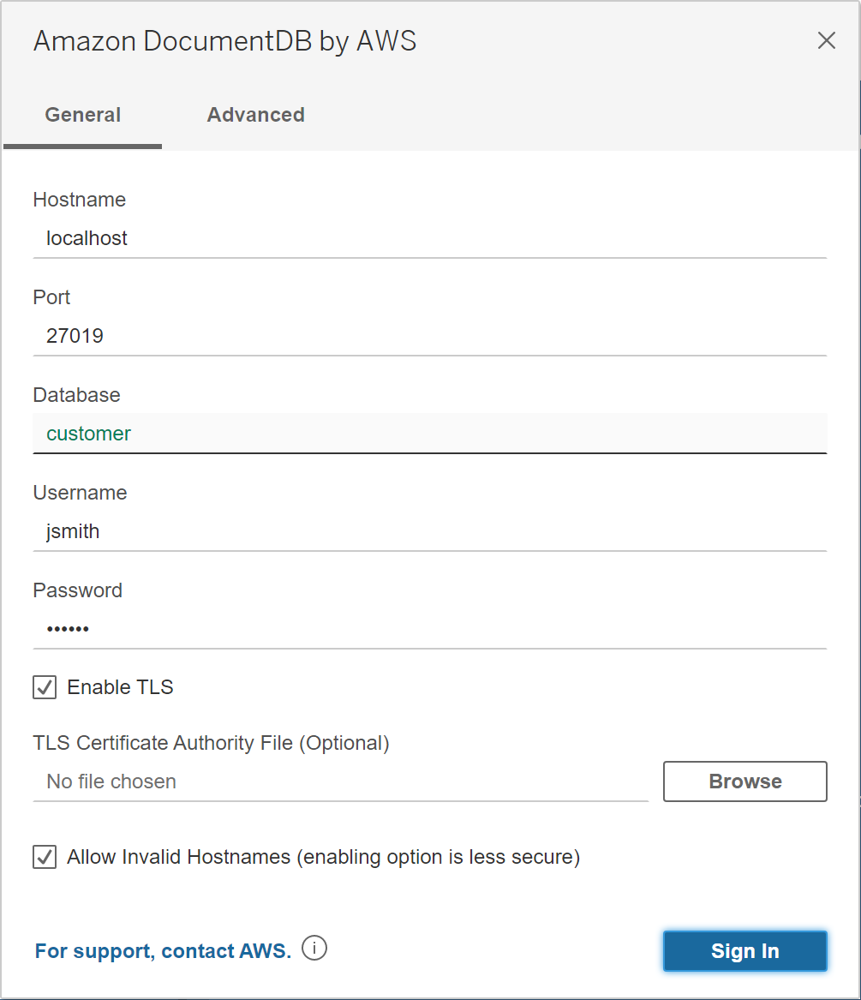
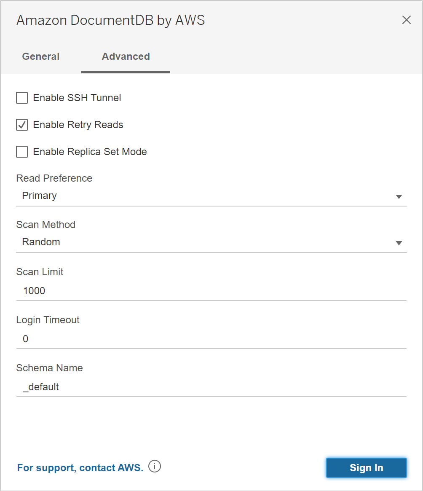
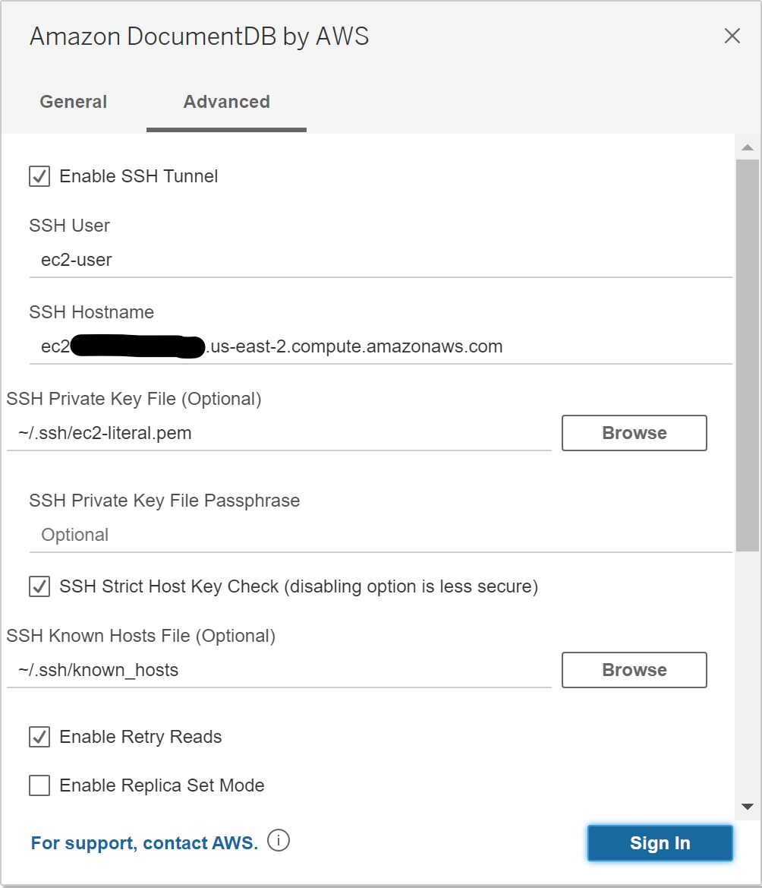
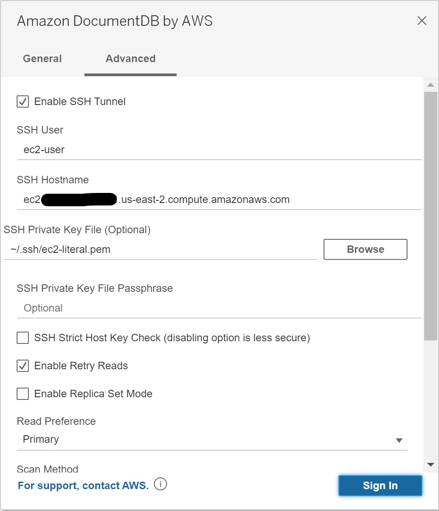
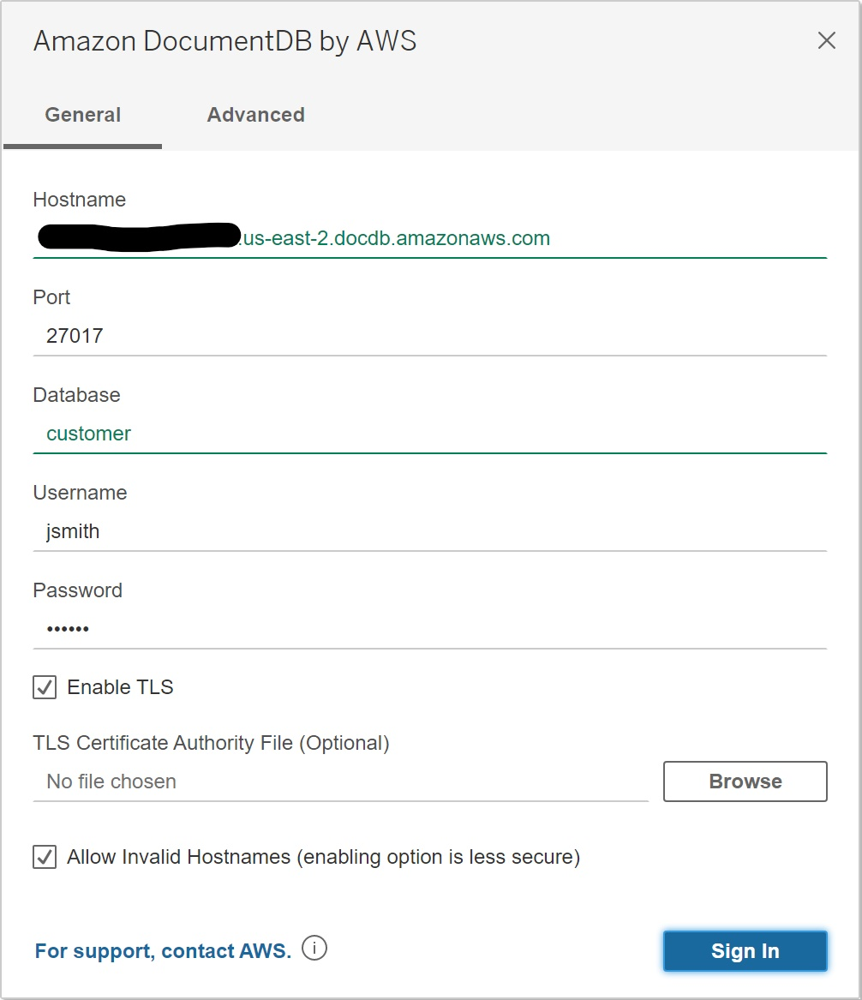
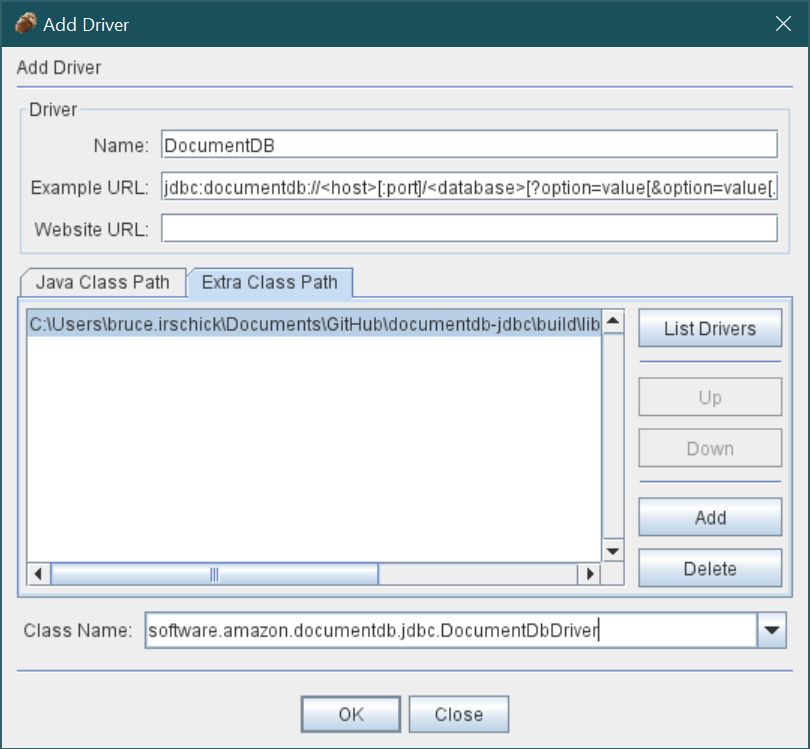

44# BI Tool Setup

The DocumentDB JDBC driver can be setup for a number of business integration (BI) applications.
Outlined here are the setup for [Tableau Desktop](https://www.tableau.com/products/desktop),
[DbVisualizer](https://www.dbvis.com/) and
[SQirreL SQL Client](https://sourceforge.net/projects/squirrel-sql/).

## Topics

- [BI Tool Setup](#bi-tool-setup)
    - [Tableau Desktop](#tableau-desktop)
    - [DbVisualizer](#dbvisualizer)
    - [SQuirreL SQL Client](#squirrel-sql-client)

## Tableau Desktop

### Adding the Amazon DocumentDB JDBC Driver

1. [Download](setup.md#download-the-documentdb-jdbc-driver) the DocumentDB JDBC driver JAR file and copy it to one of these
   directories according to your operating system:

    - **_Windows_**: `C:\Program Files\Tableau\Drivers`
    - **_Mac_**: `~/Library/Tableau/Drivers`
    - **_Linux_**: `/opt/tableau/tableau_driver/jdbc`

1. [Download](setup.md#download-the-documentdb-jdbc-driver) the DocumentDB Tableau connector (a TACO file) and copy it to your `My Tableau Repository/Connectors`
   directory.
    - **_Windows_**: `C:\Users\[user]\Documents\My Tableau Repository\Connectors`
    - **_Mac_**: `/Users/[user]/Documents/My Tableau Repository/Connectors`

   For more information, consult the [Tableau documentation](https://tableau.github.io/connector-plugin-sdk/docs/run-taco).

### Connecting to Amazon DocumentDB Using Tableau - External SSH Tunnel

2. Launch the Tableau Desktop application.
3. Navigate to **Connect > To A Server > More**. **Amazon DocumentDB by AWS** should be listed
   under **Installed Connectors**. Select it.

### Connecting to Amazon DocumentDB Using Tableau - External SSH Tunnel

1. If connecting from outside the DocumentDB cluster's VPC, ensure you have [setup an SSH tunnel](setup.md#using-an-ssh-tunnel-to-connect-to-amazon-documentdb).

2. Enter the parameters. **Hostname**, **Port**, **Database**, **Username** and **Password**
   are required while the others are optional. Descriptions for each parameter can be found in
   the [JDBC connection string](connection-string.md) documentation. As an example, the image below
   is equivalent to the connection string:
   `jdbc:documentdb://localhost:27019/test?tls=true&tlsAllowInvalidHostnames=true&scanMethod=random&scanLimit=1000&loginTimeoutSec=0&readPreference=primary&retryReads=true&schemaName=_default`
   with username and password passed separately in a properties collection.
3. Click the **Sign In** button.

4. More advanced options can be found on the **Advanced** tab.

### Connecting to Amazon DocumentDB Using Tableau - Internal SSH Tunnel

1. On the **Advanced** tab, click the **Enable SSH Tunnel** option to review further properties.

2. Enter the **SSH User**, **SSH Hostname**, and **SSH Private Key File**. Optionally, enter the
   **SSH Private Key File Passphrase** if your key file is passphrase protected.
3. Optionally, you can disable the **SSH Strict Host Key Check** option which bypasses the host key 
   check against a **known hosts** file.
   **Note:** _Disabling this option is less secure as it can lead to a
   ["man-in-the-middle" attack](https://en.wikipedia.org/wiki/Man-in-the-middle_attack)._

4. Enter the parameters. **Hostname**, **Port**, **Database**, **Username** and **Password**
   are required while the others are optional. Descriptions for each parameter can be found in
   the [JDBC connection string](connection-string.md) documentation. **Note:** _Ensure to use the 
   **DocumentDB cluster** hostname and not `localhost` when using the internal SSH tunnel option._

5. Click the **Sign In** button.

## DbVisualizer

### Adding the Amazon DocumentDB DBC Driver

Start the DbVisualizer application and navigate to the menu path: **Tools > Driver Manager...**

Click the plus icon (or menu path **Driver > Create Driver**)

1. For the **Name:** field, enter **DocumentDB**
1. For the **URL Format:** field, enter `jdbc:documentdb://<host>[:port]/<database>[?option=value[&option=value[...]]]`
1. Click the **folder** button on the right. Navigate to the location of your downloaded
   Amazon DocumentDB JDBC driver JAR file. Select the file and click the **Open** button.
   
1. Ensure the `software.amazon.documentdb.jdbc.DocumentDbDriver` is selected in the **Driver Class:**
   field. Your Driver Manager settings for **DocumentDB** should look like the following image.
   
1. Close the dialog. The **DocumentDB** JDBC driver will be setup and ready to use.

### Connecting to Amazon DocumentDB Using DbVisualizer

1. If connecting from outside the DocumentDB cluster's VPC, ensure you have [setup an SSH tunnel](setup.md#using-an-ssh-tunnel-to-connect-to-amazon-documentdb).
1. Navigate the menu path **Database > Create Database Connection**.
1. For the **Name** field, enter a descriptive name for the connection.
1. For the **Driver (JDBC)** field, choose the **DocumentDB** driver you created earlier.
1. For the **Database URL** field, enter your [JDBC connection string](connection-string.md).
   For example, `jdbc:documentdb://localhost:27017/database?tlsAllowInvalidHostnames=true`
1. For the **Database Userid** field, enter your Amazon DocumentDB user ID.
1. For the **Database Password** field, enter the corresponding password for the user ID.
1. Your **Database Connection** dialog should look like the following.
   
1. Click the **Connect** button to make the connection to your Amazon DocumentDB database.

## SQuirreL SQL Client

### Adding the Amazon DocumentDB JDBC Driver

1. If connecting from outside the DocumentDB cluster's VPC, ensure you have [setup an SSH tunnel](setup.md#using-an-ssh-tunnel-to-connect-to-amazon-documentdb).
1. Launch the SQuirrel SQL Client application.
1. Ensure the **Drivers** tab is selected.
1. Navigate to menu path ***Drivers > New Driver ...***
1. For the **Name:** field, enter **DocumentDB**.
1. For the **Example URL:** field, enter `jdbc:documentdb://<host>[:port]/<database>[?option=value[&option=value[...]]]`
1. Select the **Extra Class Path** tab.
1. Click the **Add** button and navigate to the downloaded Amazon DocumentDB JDBC driver JAR file.
1. Click **OK** to add the JAR file to the **Extra Class Path**.
1. Click the **List Drivers** button.
1. For the **Class Name:** field, ensure the `software.amazon.documentdb.jdbc.DocumentDbDriver`
   is selected.
   
1. Click the **OK** button to create and save the driver settings.

### Connecting to Amazon DocumentDB Using SQuirreL SQL Client

1. If connecting from outside the DocumentDB cluster's VPC, ensure you have [setup an SSH tunnel](setup.md#using-an-ssh-tunnel-to-connect-to-amazon-documentdb).
1. Launch the SQuirrel SQL Client application.
1. Ensure the **Aliases** table is selected.
1. Navigate the menu path **Aliases > New Alias...**.
1. For the **Name:** field, enter a name for this alias.
1. For the **Driver:** field, ensure **DocumentDB** is selected.
1. For the **URLS:** field, enter your [JDBC connection string](connection-string.md).
   For example, `jdbc:documentdb://localhost:27017/database?tlsAllowInvalidHostnames=true`
1. For the **User Name:** field, enter your Amazon DocumentDB user ID.
1. For the **Password** field, enter the corresponding password for the user ID.
   
1. Click **OK** to save the alias.
1. Double-click your alias to start the connection dialog.
1. Click the **Connect** button to connect.
