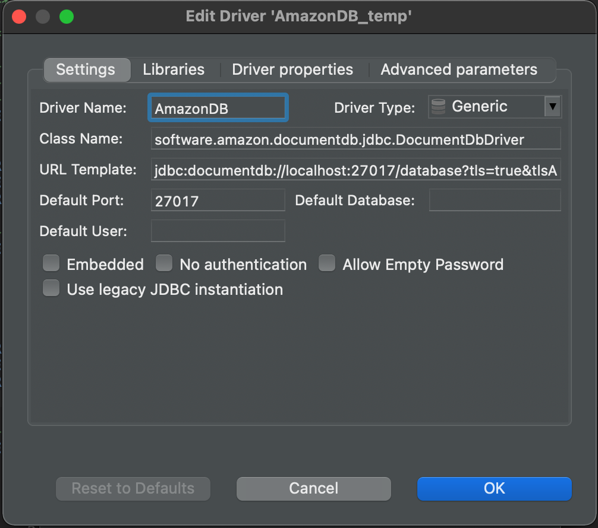
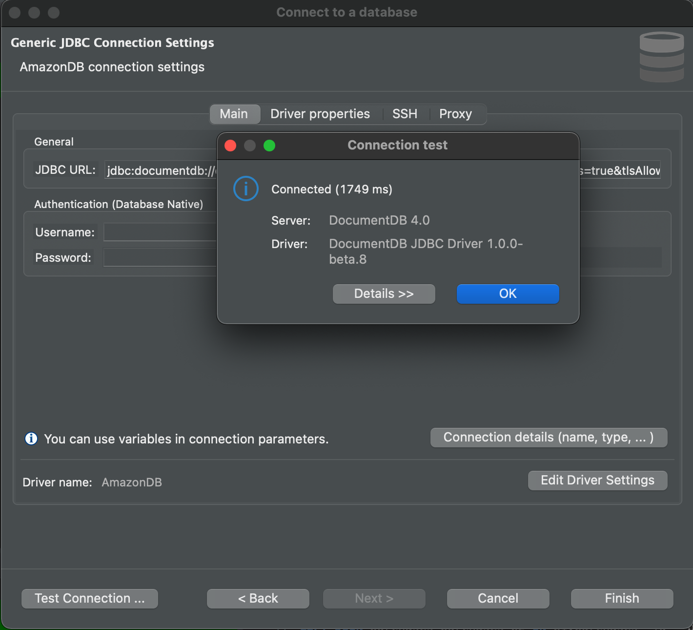

### DBeaver
[Link to product webpage](https://dbeaver.io).

#### Adding the Amazon DocumentDB JDBC Driver
1. If connecting from outside the DocumentDB cluster's VPC, ensure you have [setup an SSH tunnel](setup.md#using-an-ssh-tunnel-to-connect-to-amazon-documentdb).
2. Launch the **DBeaver** application.
3. In the main menu, navigate to and select **Database > Driver Manager > New**.
    1. In **Settings** tab, for **Driver Name** field, enter a descriptive name (e.g. AmazonDocDB)
    2. In **Settings** tab, for **URL Template** field, enter your [JDBC connection string](connection-string.md). 
    For example: `jdbc:documentdb://<username>:<password>@localhost:27017/<database-name>?tls=true&tlsAllowInvalidHostnames=true`.
    3. In **Settings** tab, for **Default Port** field, enter **27017**.
    4. In **Libraries** tab, click **Add file** and navigate and select your [Amazon DocumentDB JDBC driver JAR file](setup.md#documentdb-jdbc-driver).
    5. In **Libraries** tab, after adding the JAR file, click **Find Class**.
    6. In **Settings** tab, the field **Class Name** should be automatically filled in. If not, enter the 
    **Class Name**: *software.amazon.documentdb.jdbc.DocumentDbDriver*. Click **Ok**.
    
    

#### Connecting to Amazon DocumentDB Using Dbeaver
1. In the main menu, navigate to and select **Database > New Database Connection**.
    1. Select your database/driver created above identified by **Driver Name** you chose.
2. In the **Connect to a database** prompt:
    1. In the **Main** tab, enter the username and password for the database if it was not already entered in 
    the [JDBC connection string](connection-string.md).
    2. Click **Test Connection** to confirm your connection and then click **Finish**.

    