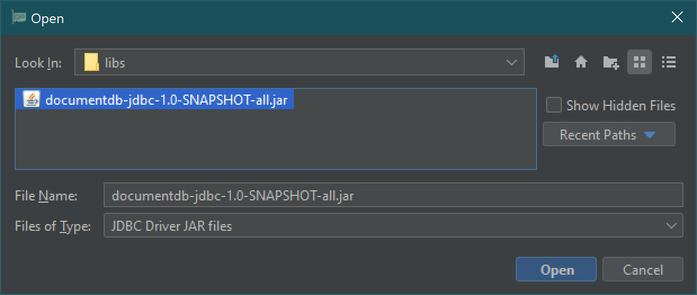
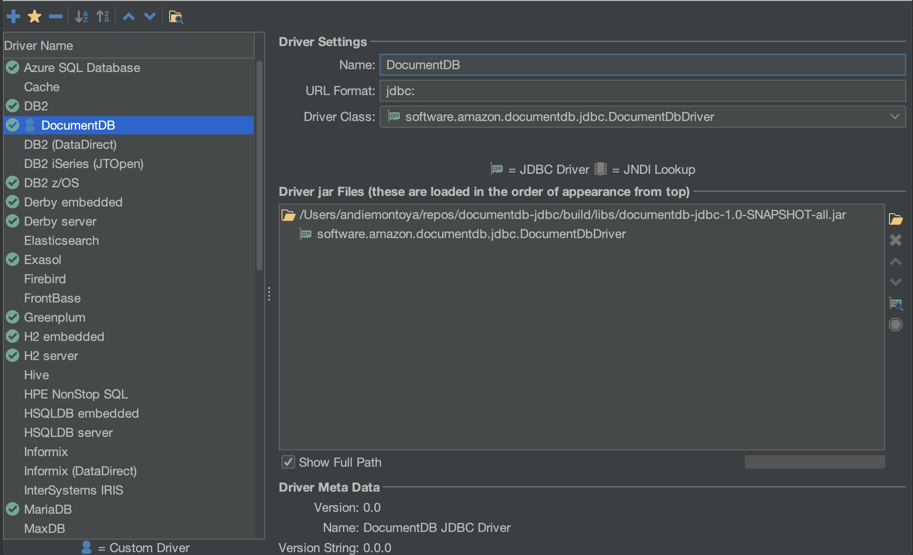
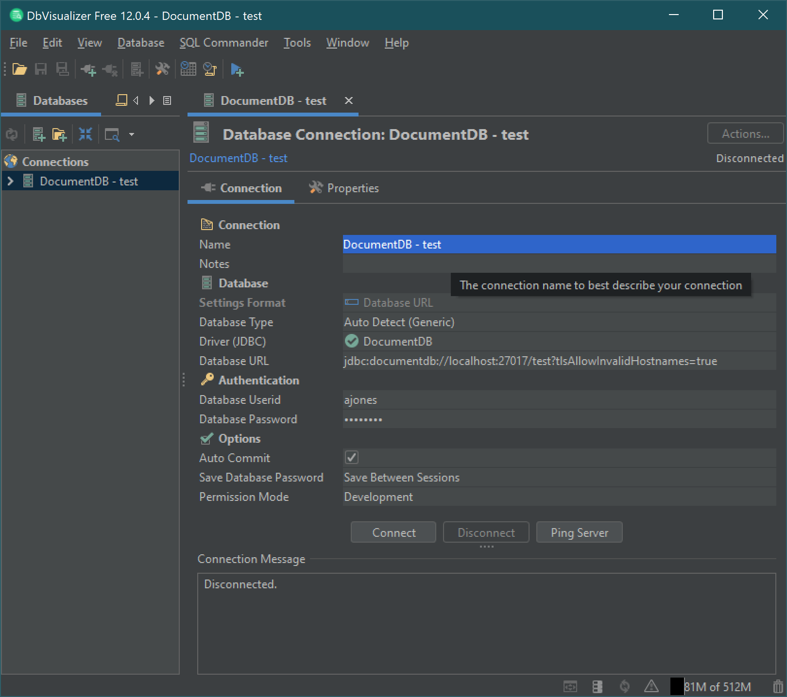

### DbVisualizer
[Link to product webpage](https://www.dbvis.com/).

#### Adding the Amazon DocumentDB DBC Driver
Start the DbVisualizer application and navigate to the menu path: **Tools > Driver Manager...**

Click the plus icon (or menu path **Driver > Create Driver**)

1. For the **Name:** field, enter **DocumentDB**
2. For the **URL Format:** field, enter `jdbc:documentdb://<host>[:<port>]/<database-name>[?<option>=<value>[&<option>=<value>[...]]]`
3. Click the **folder** button on the right. Navigate to the location of your downloaded
   Amazon DocumentDB JDBC driver JAR file. Select the file and click the **Open** button.
   
4. Ensure the `software.amazon.documentdb.jdbc.DocumentDbDriver` is selected in the **Driver Class:**
   field. Your Driver Manager settings for **DocumentDB** should look like the following image.
   
5. Close the dialog. The **DocumentDB** JDBC driver will be setup and ready to use.

#### Connecting to Amazon DocumentDB Using DbVisualizer
1. If connecting from outside the DocumentDB cluster's VPC, ensure you have [setup an SSH tunnel](setup.md#using-a-ssh-tunnel-to-connect-to-amazon-documentdb).
2. Navigate the menu path **Database > Create Database Connection**.
3. For the **Name** field, enter a descriptive name for the connection.
4. For the **Driver (JDBC)** field, choose the **DocumentDB** driver you created earlier.
5. For the **Database URL** field, enter your [JDBC connection string](connection-string.md).
   For example, `jdbc:documentdb://localhost:27017/database?tlsAllowInvalidHostnames=true`
6. For the **Database Userid** field, enter your Amazon DocumentDB user ID.
7. For the **Database Password** field, enter the corresponding password for the user ID.
8. Your **Database Connection** dialog should look like the following.
   
1. Click the **Connect** button to make the connection to your Amazon DocumentDB database.
