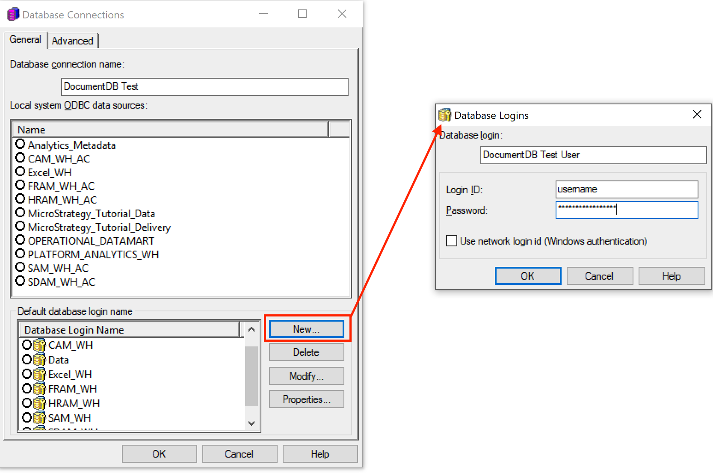
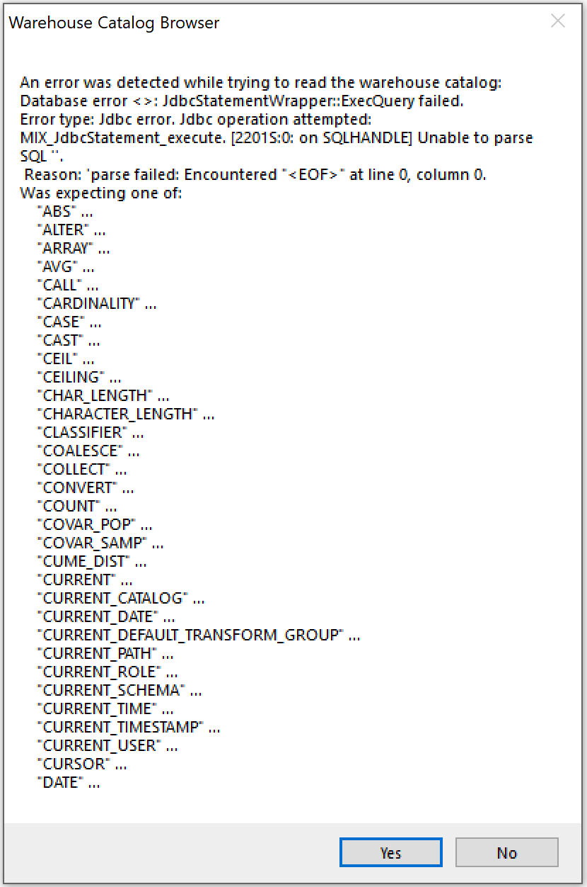

### MicroStrategy Developer
[Link to product webpage](https://community.microstrategy.com/s/products).

#### Adding the Amazon DocumentDB JDBC Driver
Reference: [https://community.microstrategy.com/s/article/KB250923-Connecting-to-Databases-using-JDBC-Drivers-in?language=en_US](https://community.microstrategy.com/s/article/KB250923-Connecting-to-Databases-using-JDBC-Drivers-in?language=en_US)
1. If connecting from outside the DocumentDB cluster's VPC, ensure you have [setup an SSH tunnel](setup.md#using-a-ssh-tunnel-to-connect-to-amazon-documentdb).
2. Copy the [DocumentDB JDBC driver JAR file](setup.md#documentdb-jdbc-driver) to a folder on the MicroStrategy 
Intelligence Server Machine.  
    - E.g. On Windows, `C:\Program Files (x86)\Common Files\Drivers\DocumentDB`.
    - E.g. On Linux, driver files should be copied to `<MSTR_INSTALL_HOME>/JDBC`. (eg; `/opt/MicroStrategy/JDBC`).
    
3. Launch the MicroStrategy Developer application and login into MicroStrategy Analytics Modules.
4. Navigate to **Microstrategy Analytics Modules > Administration > Configuration Managers > Database Instances > New > Database Instance**
or click on the icon as shown in the image below.

    
    
5. In the **Database Instances** prompt
    1. In **General** tab, for **Database instance name** field, enter a name (e.g. DocumentDB).
    2. In **General** tab, for **Database connection type** field, select **Amazon DocumentDB**.
    3. In **Advanced** tab, ensure ODBC Version **Use 3.x ODBC** calls is selected.
    4. In **General** tab, for **Database connection** field select **New**
    
        
    
    5. In **Database Connections** prompt
        1. In **General** tab, for **Database connection name** field, enter a name (e.g. DocumentDB Test)
        2. In **Advanced** tab, for **Driver execuation mode** field, ensure **Synchronous** is selected.
        3. In **Advanced** tab, for **Additional connection string parameters** field, enter the filepath of driver JAR 
        file, driver class name and your [JDBC connection string](connection-string.md) as the URL
        
            ~~~
            JDBC;MSTR_JDBC_JAR_FOLDER=C:\Program Files (x86)\Common Files\Drivers\DocumentDB;DRIVER=software.amazon.documentdb.jdbc.DocumentDbDriver;URL={jdbc:documentdb://<IP/URL>};
            ~~~
       
            For example `URL={jdbc:documentdb://localhost:27019/<database-name>?tls=true&tlsAllowInvalidHostnames=true}`
        
            
        
        4. In **General** tab, create a new **Database Login Name** by selecting **New** and enter your database.
        **Login ID** and **Password**.
        
             
        
        5. In **General** tab, select your **Database Login Name** that you just created as the **Default database login
        name** and select **OK**.
        
        6. If you get the following message (see image below), select **OK**.
        
            
       
    6. You will return to the **Database Instances** prompt, select the **Database Connection** you just created and 
    click **OK**.
    
6. Users should now be able to connect successfully via JDBC from both the **Warehouse Catalog** and **Data Import**.

#### Connecting to Amazon DocumentDB Using Microstrategy Developer Warehouse Catalog
1. In the main menu navigate to and select **Schema > Create New Project**.
2. Choose a **Project Name** and **Directory**.
3. Click **Select tables from the Warehouse Catalog**.
4. In the **Warehouse Database Instance** prompt, select the **Database instance name** you chose when creating a
connection as the **Primary Database Instance for the Project** and click **Ok**.

    

5. If you are given the following error (see image below), select **yes**.

    
    
    1. In **Warehouse Catalog Options** prompt, under **Categories > Catalog > Warehouse Connection** ensure for 
    **Custom Database Login** your **Database Login Name** that you created is selected.
    
        
        
    2. In **Warehouse Catalog Options** prompt, under **Categories > Catalog > Read Settings** ensure
    **Use standard ODBC calls to obtain the database catalog** is selected.
    
        
        
    3. Click **Ok** and you should be able to read in tables from your database instance from the **Warehouse Catalog**
    and use them in your project. 
    
        
    