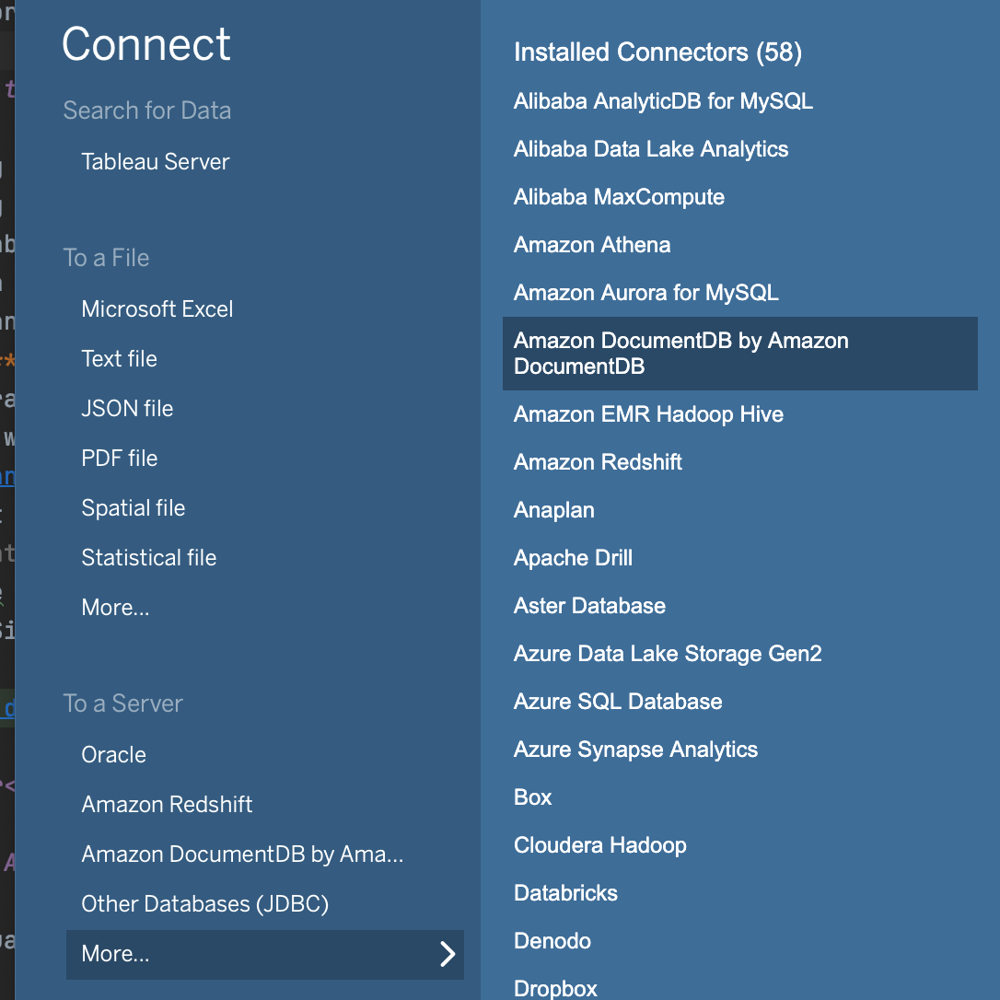
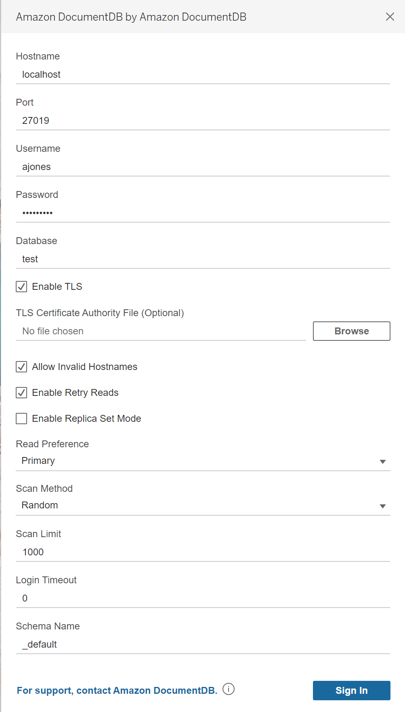
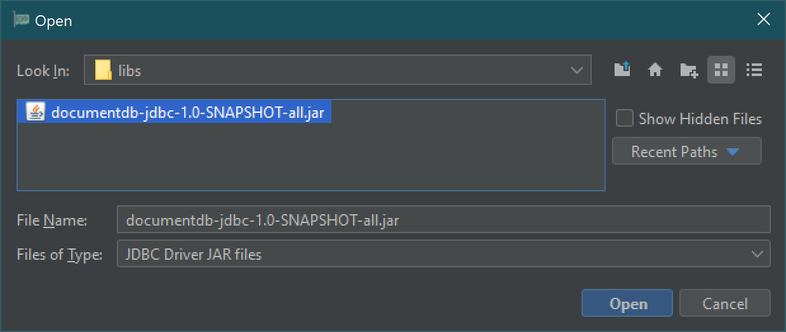
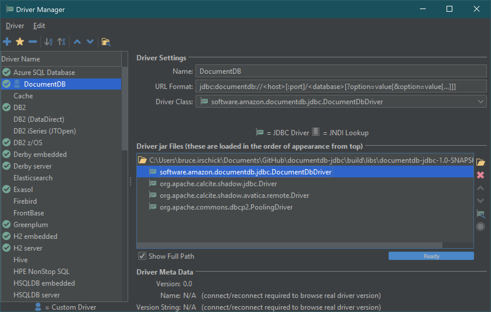
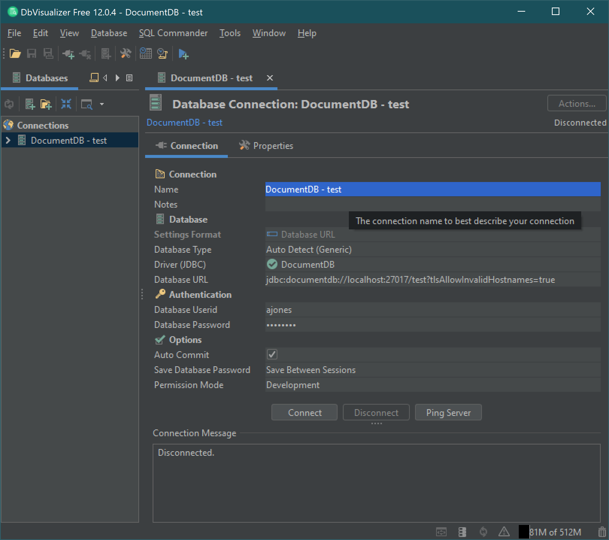
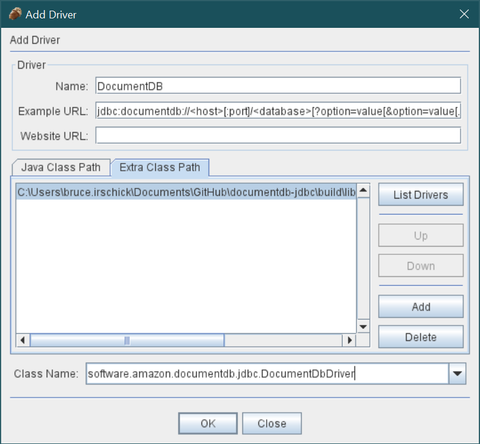
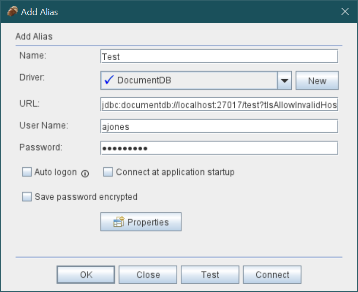

# Amazon DocumentDB JDBC Driver Setup

The DocumentDB JDBC driver can be setup for a number of business integration (BI) applications. 
Outlined here are the setup for [Tableau Desktop](https://www.tableau.com/products/desktop),
[DbVisualizer](https://www.dbvis.com/) and 
[SQirreL SQL Client](https://sourceforge.net/projects/squirrel-sql/).

## Topics

- [Getting Started](#getting-started)
    - [Prerequisites](#prerequisites)  
        - [DocumentDB Cluster](#documentdb-cluster)
        - [JRE or JDK Installation](#jre-or-jdk-installation) 
        - [Download the DocumentDB JDBC Driver](#download-the-documentdb-jdbc-driver)
    - [Specifying the Amazon RDS Certificate Authority Certificate File](#adding-amazon-rds-certificate-bundle) 
    - [Using an SSH Tunnel to Connect to Amazon DocumentDB](#using-an-ssh-tunnel-to-connect-to-amazon-documentdb)
    
- [BI Tool Setup](#bi-tool-setup)
    - [Tableau Desktop](#tableau-desktop)
    - [DbVisualizer](#dbvisualizer)
    - [SQuirreL SQL Client](#squirrel-sql-client)

## Getting Started<a name='getting-started' />

### Prerequisites<a name='prerequisites' />

#### DocumentDB Cluster<a name='documentdb-cluster' />

If you don't already have an Amazon DocumentDB cluster, there are a number of ways to 
[get started](https://docs.aws.amazon.com/documentdb/latest/developerguide/get-started-guide.html). 

Note that DocumentDB is a Virtual Private Cloud (VPC) only service. 
If you will be connecting from a local machine outside the cluster's VPC, you will need to 
create an SSH connection to an Amazon EC2 instance. In this case, launch your cluster using the instructions in 
[Connect with EC2](https://docs.aws.amazon.com/documentdb/latest/developerguide/connect-ec2.html). 
See [Using an SSH Tunnel to Connect to Amazon DocumentDB](#using-an-ssh-tunnel-to-connect-to-amazon-documentdb) 
for more information on ssh tunneling and when you might need it.

#### JRE or JDK Installation<a name='jre-or-jdk-installation' />

Depending on your BI application, you may need to ensure a 64-bit JRE or JDK installation version 8 
or later is installed on your computer. You can download the Java SE Runtime Environment 8 
[here](https://www.oracle.com/ca-en/java/technologies/javase-jre8-downloads.html).  

#### Download the DocumentDB JDBC Driver <a name='download-the-documentdb-jdbc-driver' />

<!-- >TODO: Get link for DocumentDB JDBC driver. -->
Download the DocumentDB JDBC driver here. The driver is packaged as a single JAR file
(e.g., `documentdb-jdbc-1.0-SNAPSHOT-all.jar`).

### Specifying the Amazon RDS Certificate Authority Certificate File <a name='adding-amazon-rds-certificate-bundle' />

If you are connecting to a TLS-enabled cluster, you may want to 
[specify the Amazon RDS Certificate Authority certificate](amazon-ca-certs.md) on your connection string.

To determine whether your cluster is TLS-enabled, you can 
[check the value of your cluster's `tls` parameter](https://docs.aws.amazon.com/documentdb/latest/developerguide/connect_programmatically.html#connect_programmatically-determine_tls_value).

### Using an SSH Tunnel to Connect to Amazon DocumentDB<a name='using-an-ssh-tunnel-to-connect-to-amazon-documentdb' />

Amazon DocumentDB (with MongoDB compatibility) clusters are deployed within an Amazon Virtual Private Cloud (Amazon VPC). 
They can be accessed directly by Amazon EC2 instances or other AWS services that are deployed in the same Amazon VPC. 
Additionally, Amazon DocumentDB can be accessed by EC2 instances 
or other AWS services in different VPCs in the same AWS Region or other Regions via VPC peering.

However, suppose that your use case requires that you (or your application) access your Amazon DocumentDB resources 
from outside the cluster's VPC. This will be the case for most users not running their application 
on a VM in the same VPC as the DocumentDB cluster. When connecting from outside the VPC, 
you can use SSH tunneling (also known as  _port forwarding_) to access your Amazon DocumentDB resources.

To create an SSH tunnel, you need an Amazon EC2 instance running in the same Amazon VPC as your Amazon DocumentDB cluster. You can either use an existing EC2 instance in the same VPC as your cluster or create one.

You can set up an SSH tunnel to the Amazon DocumentDB cluster `sample-cluster.node.us-east-1.docdb.amazonaws.com` by running the following command on your local computer. The `-L` flag is used for forwarding a local port.
```
ssh -i "ec2Access.pem" -L 27017:sample-cluster.node.us-east-1.docdb.amazonaws.com:27017 ubuntu@ec2-34-229-221-164.compute-1.amazonaws.com -N 
```
This is a prerequisite for connecting to any BI tool running on a client outside your VPC. Once you run the step above you can move on to the next steps for the BI tool of your choice.

For further information on SSH tunneling , please refer to the documentation on
[Connecting from Outside an Amazon VPC.](https://docs.aws.amazon.com/documentdb/latest/developerguide/connect-from-outside-a-vpc.html)

## BI Tool Setup<a name='bi-tool-setup' />

### Tableau Desktop<a name='tableau-desktop' />

#### Adding the Amazon DocumentDB JDBC Driver

1. [Download](#download-the-documentdb-jdbc-driver) the DocumentDB JDBC driver JAR file and copy it to one of these
   directories according to your operating system:

    - **_Windows_**: `C:\Program Files\Tableau\Drivers`
    - **_Mac_**: `~/Library/Tableau/Drivers`
    - **_Linux_**: `/opt/tableau/tableau_driver/jdbc`

1. [Download]() the DocumentDB Tableau connector (a TACO file) and copy it to your `My Tableau Repository/Connectors`
   directory.
    - **_Windows_**: `C:\Users\[Windows User]\Documents\My Tableau Repository\Connectors`
    - **_Mac_**: `/Users/[user]/Documents/My Tableau Repository/Connectors`

   For more information, consult the [Tableau documentation](https://tableau.github.io/connector-plugin-sdk/docs/run-taco). 

#### Connecting to Amazon DocumentDB Using Tableau

1. If connecting from outside the DocumentDB cluster's VPC, ensure you have [setup an SSH tunnel](#using-an-ssh-tunnel-to-connect-to-amazon-documentdb).
1. Launch the Tableau Desktop application.
    - If using a **signed** Tableau Connector, launch Tableau like a typical application on your machine.
    - If using an **unsigned** Tableau connector, Tableau must be launched from the command line with the flag
      `-DDisableVerifyConnectorPluginSignature=true`. 
      
      Assuming default installation of Tableau Desktop:
        - On **Windows**, use `tableau.exe -DDisableVerifyConnectorPluginSignature=true`. 
        - On **Mac**, use `/Applications/Tableau\ Desktop\ [version].app/Contents/MacOS/Tableau -DDisableVerifyConnectorPluginSignature=true`.
        - For more information, consult the [Tableau documentation](https://tableau.github.io/connector-plugin-sdk/docs/run-taco).
      
1. Navigate to **Connect > To A Server > More**. **Amazon DocumentDB by Amazon DocumentDB** should be listed 
   under **Installed Connectors**. Select it.
   

   
1. Enter the parameters. **Hostname**, **Port**, **Database**, **Username** and **Password** 
   are required while the others are optional. Descriptions for each parameter can be found in 
   the [JDBC connection string](connection-string.md) documentation. As an example, the image below 
   is equivalent to the connection string:
   `jdbc:documentdb://localhost:27019/test?tls=true&tlsAllowInvalidHostnames=true&scanMethod=random&scanLimit=1000&loginTimeoutSec=0&readPreference=primary&retryReads=true&schemaName=_default` 
   with username and password passed separately in a properties collection.
1. Click the **Sign In** button.



### DbVisualizer<a name='dbvisualizer' />

#### Adding the Amazon DocumentDB JDBC Driver

Start the DbVisualizer application and navigate to the menu path: **Tools > Driver Manager...** 

Click the plus icon (or menu path **Driver > Create Driver**)

1. For the **Name:** field, enter **DocumentDB**
1. For the **URL Format:** field, enter `jdbc:documentdb://<host>[:port]/<database>[?option=value[&option=value[...]]]`
1. Click the **folder** button on the right. Navigate to the location of your downloaded 
   Amazon DocumentDB JDBC driver JAR file. Select the file and click the **Open** button.
   
1. Ensure the `software.amazon.documentdb.jdbc.DocumentDbDriver` is selected in the **Driver Class:**
   field. Your Driver Manager settings for **DocumentDB** should look like the following image.
   
1. Close the dialog. The **DocumentDB** JDBC driver will be setup and ready to use.

#### Connecting to Amazon DocumentDB Using DbVisualizer

1. If connecting from outside the DocumentDB cluster's VPC, ensure you have [setup an SSH tunnel](#using-an-ssh-tunnel-to-connect-to-amazon-documentdb).
1. Navigate the menu path **Database > Create Database Connection**.
1. For the **Name** field, enter a descriptive name for the connection.
1. For the **Driver (JDBC)** field, choose the **DocumentDB** driver you created earlier.
1. For the **Database URL** field, enter your [JDBC connection string](connection-string.md). 
   For example, `jdbc:documentdb://localhost:27017/database?tlsAllowInvalidHostnames=true`
1. For the **Database Userid** field, enter your Amazon DocumentDB user ID.
1. For the **Database Password** field, enter the corresponding password for the user ID.
1. Your **Database Connection** dialog should look like the following.
   
1. Click the **Connect** button to make the connection to your Amazon DocumentDB database.

### SQuirreL SQL Client<a name='squirrel-sql-client' />

#### Adding the Amazon DocumentDB JDBC Driver

1. If connecting from outside the DocumentDB cluster's VPC, ensure you have [setup an SSH tunnel](#using-an-ssh-tunnel-to-connect-to-amazon-documentdb).
1. Launch the SQuirrel SQL Client application.
1. Ensure the **Drivers** tab is selected.
1. Navigate to menu path ***Drivers > New Driver ...***
1. For the **Name:** field, enter **DocumentDB**.
1. For the **Example URL:** field, enter `jdbc:documentdb://<host>[:port]/<database>[?option=value[&option=value[...]]]`
1. Select the **Extra Class Path** tab.
1. Click the **Add** button and navigate to the downloaded Amazon DocumentDB JDBC driver JAR file.
1. Click **OK** to add the JAR file to the **Extra Class Path**.
1. Click the **List Drivers** button.
1. For the **Class Name:** field, ensure the `software.amazon.documentdb.jdbc.DocumentDbDriver` 
   is selected.
   
1. Click the **OK** button to create and save the driver settings.

#### Connecting to Amazon DocumentDB Using SQuirreL SQL Client

1. If connecting from outside the DocumentDB cluster's VPC, ensure you have [setup an SSH tunnel](#using-an-ssh-tunnel-to-connect-to-amazon-documentdb).
1. Launch the SQuirrel SQL Client application.
1. Ensure the **Aliases** table is selected.
1. Navigate the menu path **Aliases > New Alias...**.
1. For the **Name:** field, enter a name for this alias.
1. For the **Driver:** field, ensure **DocumentDB** is selected.
1. For the **URLS:** field, enter your [JDBC connection string](connection-string.md).
   For example, `jdbc:documentdb://localhost:27017/database?tlsAllowInvalidHostnames=true`
1. For the **User Name:** field, enter your Amazon DocumentDB user ID.
1. For the **Password** field, enter the corresponding password for the user ID.
   
1. Click **OK** to save the alias.
1. Double-click your alias to start the connection dialog.
1. Click the **Connect** button to connect.
