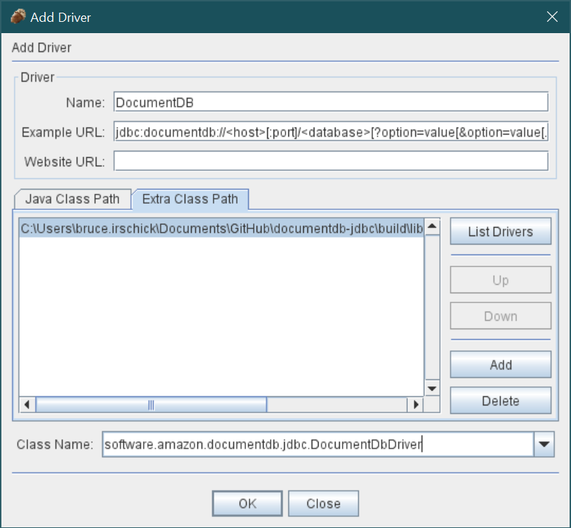
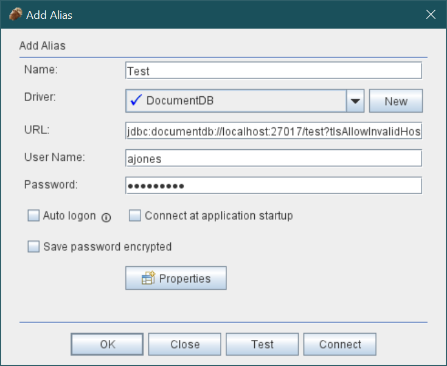

### SQuirreL SQL Client
[Link to product webpage](https://sourceforge.net/projects/squirrel-sql/).

#### Adding the Amazon DocumentDB JDBC Driver
1. If connecting from outside the DocumentDB cluster's VPC, ensure you have [setup an SSH tunnel](setup.md#using-a-ssh-tunnel-to-connect-to-amazon-documentdb).
2. Launch the SQuirrel SQL Client application.
3. Ensure the **Drivers** tab is selected.
4. Navigate to menu path ***Drivers > New Driver ...***
5. For the **Name:** field, enter **DocumentDB**.
6. For the **Example URL:** field, enter `jdbc:documentdb://<host>[:port]/<database>[?option=value[&option=value[...]]]`
7. Select the **Extra Class Path** tab.
8. Click the **Add** button and navigate to the downloaded Amazon DocumentDB JDBC driver JAR file.
9. Click **OK** to add the JAR file to the **Extra Class Path**.
10. Click the **List Drivers** button.
11. For the **Class Name:** field, ensure the `software.amazon.documentdb.jdbc.DocumentDbDriver`
   is selected.
   
12. Click the **OK** button to create and save the driver settings.

#### Connecting to Amazon DocumentDB Using SQuirreL SQL Client
1. If connecting from outside the DocumentDB cluster's VPC, ensure you have [setup an SSH tunnel](setup.md#using-a-ssh-tunnel-to-connect-to-amazon-documentdb).
2. Launch the SQuirrel SQL Client application.
3. Ensure the **Aliases** table is selected.
4. Navigate the menu path **Aliases > New Alias...**.
5. For the **Name:** field, enter a name for this alias.
6. For the **Driver:** field, ensure **DocumentDB** is selected.
7. For the **URLS:** field, enter your [JDBC connection string](connection-string.md).
   For example, `jdbc:documentdb://localhost:27017/database?tlsAllowInvalidHostnames=true`
8. For the **User Name:** field, enter your Amazon DocumentDB user ID.
9. For the **Password** field, enter the corresponding password for the user ID.
   
10. Click **OK** to save the alias.
11. Double-click your alias to start the connection dialog.
12. Click the **Connect** button to connect.