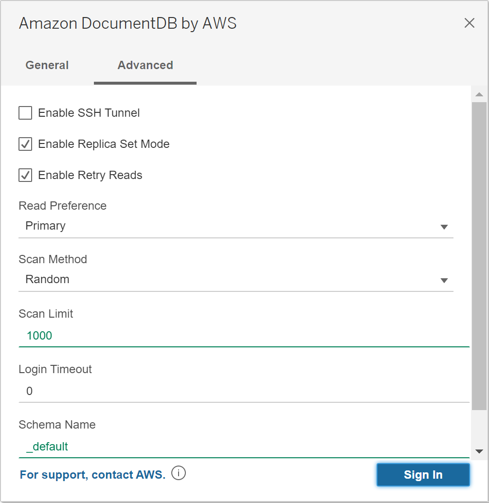
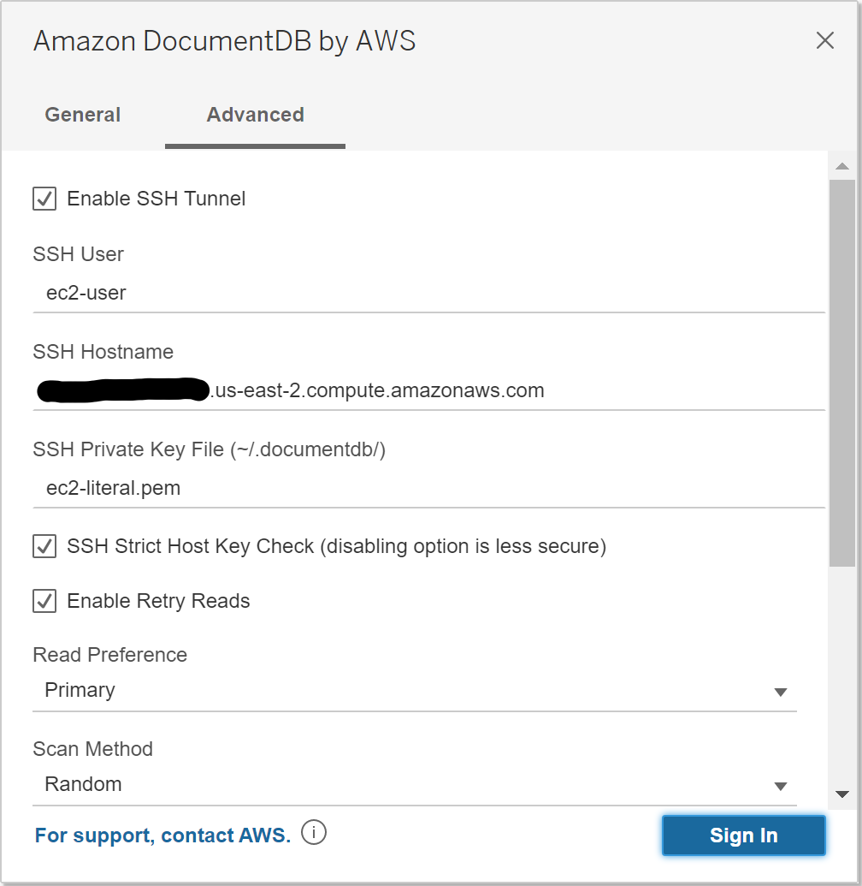
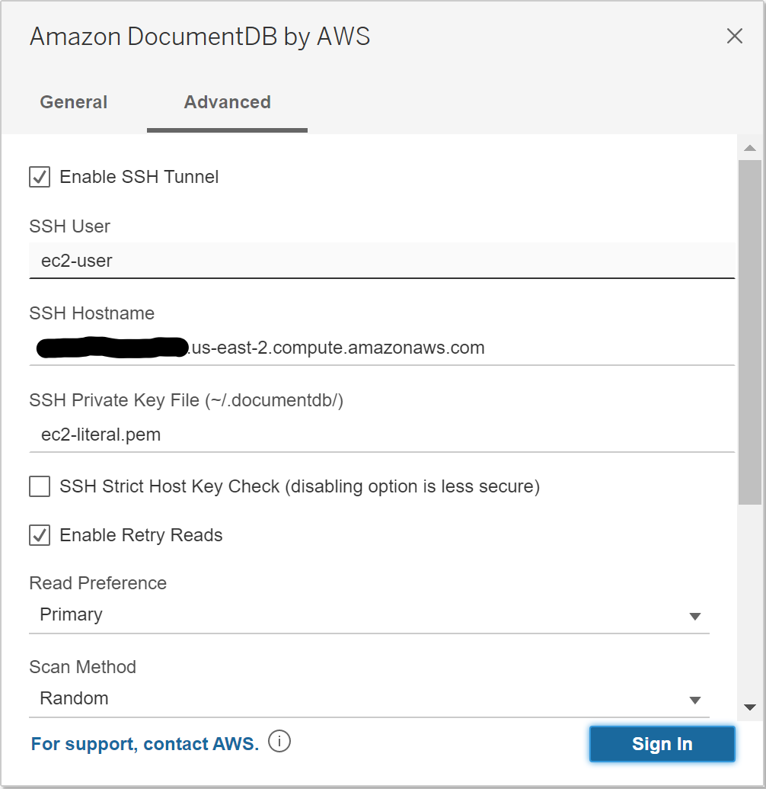

### Tableau Desktop
[Link to product webpage](https://www.tableau.com/products/desktop).

#### Adding the Amazon DocumentDB JDBC Driver
1. [Download](https://github.com/aws/amazon-documentdb-jdbc-driver/releases/latest) the DocumentDB JDBC driver JAR file and copy it to one of these
   directories according to your operating system:
    - **_Windows_**: `C:\Program Files\Tableau\Drivers`
    - **_Mac_**: `~/Library/Tableau/Drivers`

2. [Download](https://github.com/aws/amazon-documentdb-jdbc-driver/releases/latest) the DocumentDB Tableau connector (a TACO file) and copy it to your `My Tableau Repository/Connectors`
   directory.
    - **_Windows_**: `C:\Users\[user]\Documents\My Tableau Repository\Connectors`
    - **_Mac_**: `/Users/[user]/Documents/My Tableau Repository/Connectors`

   For more information, consult the [Tableau documentation](https://tableau.github.io/connector-plugin-sdk/docs/run-taco).

#### Connecting to Amazon DocumentDB Using Tableau - External SSH Tunnel
1. Launch the Tableau Desktop application.

2. Navigate to **Connect > To A Server > More**. **Amazon DocumentDB by Amazon Web Services** should be listed
   under **Installed Connectors**. Select it.

    

#### Connecting to Amazon DocumentDB Using Tableau - External SSH Tunnel
1. If connecting from outside the DocumentDB cluster's VPC, ensure you have [setup an SSH tunnel](setup.md#using-an-ssh-tunnel-to-connect-to-amazon-documentdb).

2. Enter the parameters. **Hostname**, **Port**, **Database**, **Username** and **Password**
   are required while the others are optional. Descriptions for each parameter can be found in
   the [JDBC connection string](connection-string.md) documentation. As an example, the image below
   is equivalent to the connection string:
   `jdbc:documentdb://localhost:27019/test?tls=true&tlsAllowInvalidHostnames=true&scanMethod=random&scanLimit=1000&loginTimeoutSec=0&readPreference=primary&retryReads=true&schemaName=_default`
   with username and password passed separately in a properties collection.

3. Click the **Sign In** button.

    

4. More advanced options can be found on the **Advanced** tab.

    

#### Connecting to Amazon DocumentDB Using Tableau - Internal SSH Tunnel
1. On the **Advanced** tab, click the **Enable SSH Tunnel** option to review further properties.

    

2. Enter the **SSH User**, **SSH Hostname**, and **SSH Private Key File**. 
3. Optionally, you can disable the **SSH Strict Host Key Check** option which bypasses the host key 
   check against a **known hosts** file.
   **Note:** _Disabling this option is less secure as it can lead to a
   ["man-in-the-middle" attack](https://en.wikipedia.org/wiki/Man-in-the-middle_attack)._

    

4. Enter the parameters. **Hostname**, **Port**, **Database**, **Username** and **Password**
   are required while the others are optional. Descriptions for each parameter can be found in
   the [JDBC connection string](connection-string.md) documentation. **Note:** _Ensure to use the 
   **DocumentDB cluster** hostname and not `localhost` when using the internal SSH tunnel option._

    

5. Click the **Sign In** button.
